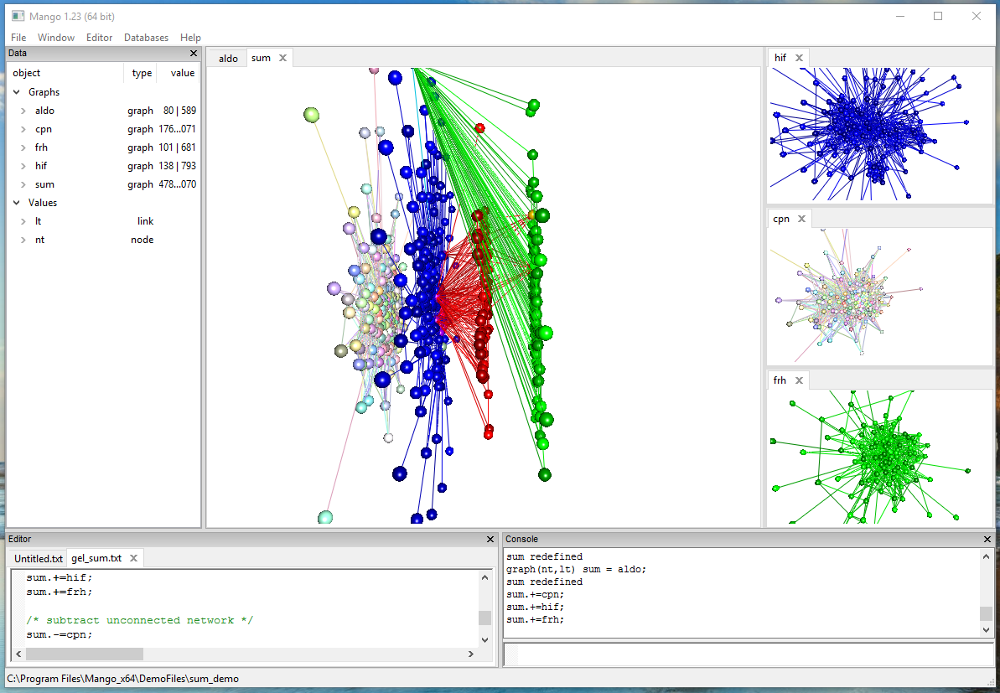

# Why learn Mango?

This book introduces Mango, an environment for integrating, exploring and analyzing heterogeneous networks. Mango development started in Summer of 2014 as a response to a need for scalable, flexible methods of integrating massive networks. 

### Dealing with complexity...

Complex means "composed of many different parts". What word better describes the state of data analysis today? From open  digital repositories to self reported personal information, companies and individuals have access to a treasure trove of information. But transforming this seemingly endless supply of data into practical applications continues to be a monolithic and many-headed beast.

The explosion of publicly available data means anyone can become a professional analyst. The analysis of data is defined as the process of inspecting, cleaning, transforming, and modeling data with the goal of discovering useful information, suggesting conclusions, and supporting decision-making. The major hurdle is time and complexity. Analysts often go through a multi-step process to download, clean, integrate, and analyze data. Time and effort is needed to logically organize the data before data exploration can begin. The developers of Mango hoped to develop a tool that enabled data analysts to interact with the data in a way that is effective, fast, and user-friendly.

Mango grew out of the belief that complex does not have to mean difficult and overwhelming. Using a set of starting principles, complexity can be managed, integrated, and interpreted. We, as developers, wanted to make serendipitous discoveries more accessible and user friendly. From this goal, we developed the Mango system and this book will introduce you, the reader, to the playground of network analysis. 

**A paper on Mango has been published online in BioData Mining on August 2016:**

[Chang, J., Cho, H., and Chou, H., "Mango: combining and analyzing heterogeneous biological networks", *BioData Mining*, August 2016](http://biodatamining.biomedcentral.com/articles/10.1186/s13040-016-0105-5)

