# Airline Flights Example


http://blog.revolutionanalytics.com/2011/05/mapping-airline-flight-networks-with-r.html

This is the propagate example from Mango using the flights data from the blog.

* Put github link here.
* Folder should contain processed flights and airlines network. 
* User opens gel.txt. Runs line by line and explore the network.

**Outline**

* Load airports and flights data
* Combine airports by state
* Fetch flights going into or out of Iowa
* Infection Simulation

## Load airports and flights data
```
node(string iata, string airport, string city, string state, string country, 
float lat, float long) nt;
link[int cnt, string airline] lt;

graph(nt,lt) airports=import("airports.net");
graph(nt,lt) flights=import("flights.net");
```

Since airports contains longitude and latitude values, map them to xy coordinates and center the graph on Denver Airport.
```
/* layout */
foreach node in airports set _x=long, _y=lat, _z=0;
center(airports,"DEN");
```

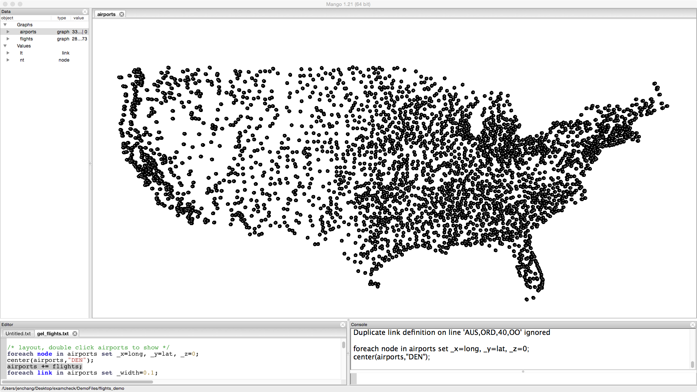

Add in the flights data:
```
airports += flights;
foreach link in airports set _width=0.1;
```

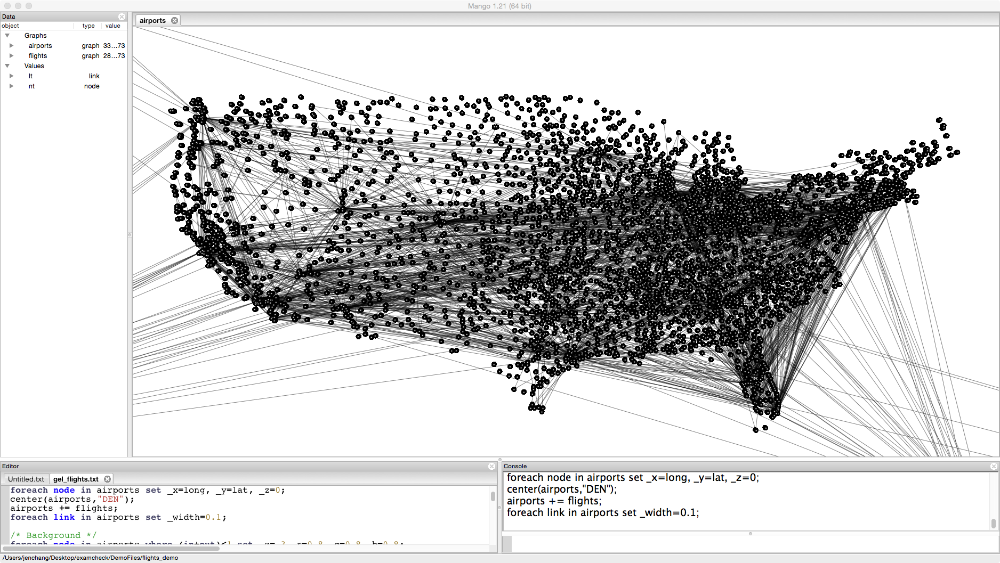

If you zoom in on the graph, some of the airports are unconnected. Flights only contains major airlines. We could delete unconnected nodes by typing the following: Do not run this code yet.

```
airports=select node from airports where (in+out)>0;
```
But since we want to keep the shape of the United States, we are going to use those  unconnected nodes as a background, moving them back 3 units and setting their color to grey.

```
foreach node in airports where (in+out)<1 set _z=-3,_r=0.8,_g=0.8,_b=0.8;
```

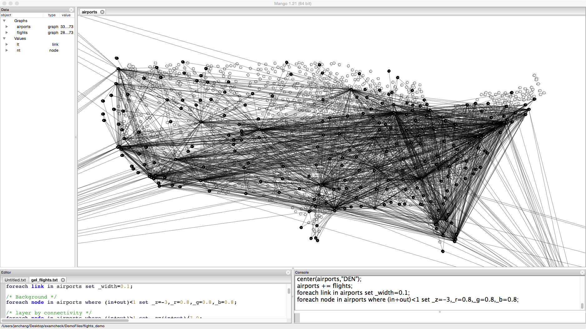

You can click on the graph and drag to tilt the visualization. Since this is already a 3D graph, we can make further use of the z dimension. For example, we can map connectivity of the airports to height.

```
foreach node in airports where (in+out)>1 set _z=(in+out)/7.0;
```

In a "foreach node" statement, the special terms "in" and "out" represent the number of in degrees for a node and out degrees for a node. I've scaled connectivity by 7.0, so it doesn't jump too far out of the screen. Feel free to adjust as you need.

Next we are going to randomly color the airports and bleed those colors down the links. This will emphasize flights from highly connected airports to less highly connected airports.

```
foreach node in airports where (in+out)>0 set _r=rand(0,1), _g=rand(0,1),_b=rand(0,1);
foreach link in airports where in._z>out._z set _r=in._r,_g=in._g,_b=in._b;
foreach link in airports where in._z<=out._z set _r=out._r,_g=out._g,_b=out._b;
```

In a "foreach link" statement, the special terms "in" and "out" represent the in node and out node of a link. In an undirected graph, the assignments have no further meaning. In a directed graph, the link is directed from the in node to the out node.

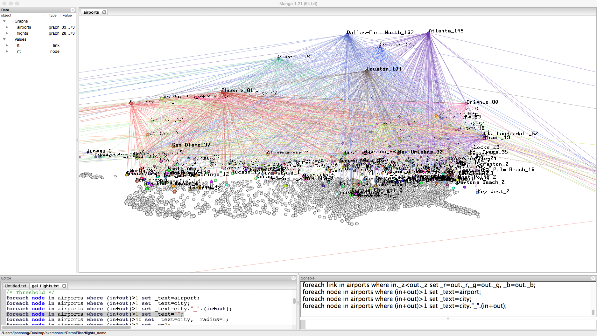

We can use this layout to try to set a threshold. For example, we might want to emphasize airports that are highly connected but don't know what threshold value to set. Try the following commands and see how the visualization changes.

```
foreach node in airports where (in+out)>1 set _text=airport;
foreach node in airports where (in+out)>1 set _text=city;
foreach node in airports where (in+out)>1 set _text=city."_".(in+out);
```

In this case, let's choose 40. Any airport with a connectivity above 40 will have a larger radius and be labeled by city name.

```
foreach node in airports where (in+out)>1 set _text="";
foreach node in airports where (in+out)>40 set _text=city, _radius=1;
foreach node in airports where (in+out)>0 set _z=0;
```

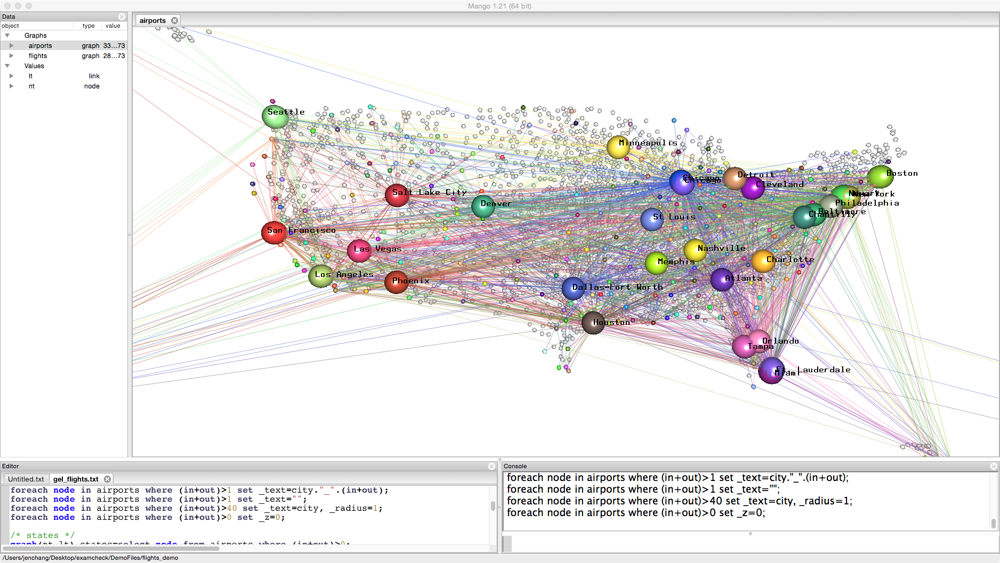

##Combine airports by state

Sometimes you may want to group or combine nodes. This is a one way modification so we'll create a duplicate graph called states.

```
graph(nt,lt) states=select node from airports where (in+out)>0;
foreach node in states set _radius=0.2;
foreach node in states set _text=state;
```

We can use the map command to change the node ids. This map command can either use a node attribute or a new map graph. Type **help map;** for more information.

```
states=map(states,"state");
```

The first argument is the graph name. The second argument is the node attribute for the new  node id.

In this example, we've lost the background image. Let's create a new background graph and add it to states.
```
graph(nt,lt) background=select node from airports where (in+out)<1;
states.+=background;
foreach node in background set _r=0.8,_g=0.8,_b=0.8;
```

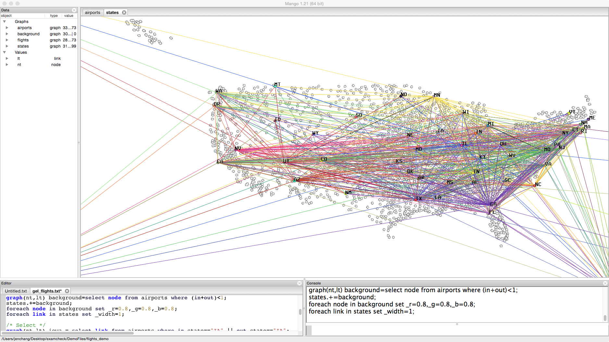

##Fetch flights going into or out of Iowa

```
graph(nt,lt) iowa = select link from airports where in.state=="IA" || out.state=="IA";
foreach link in iowa set _r=1,_g=0,_b=0, _width=2, _text="";
foreach node in iowa set _radius=0.5,_text=state;
iowa.+=background;
```

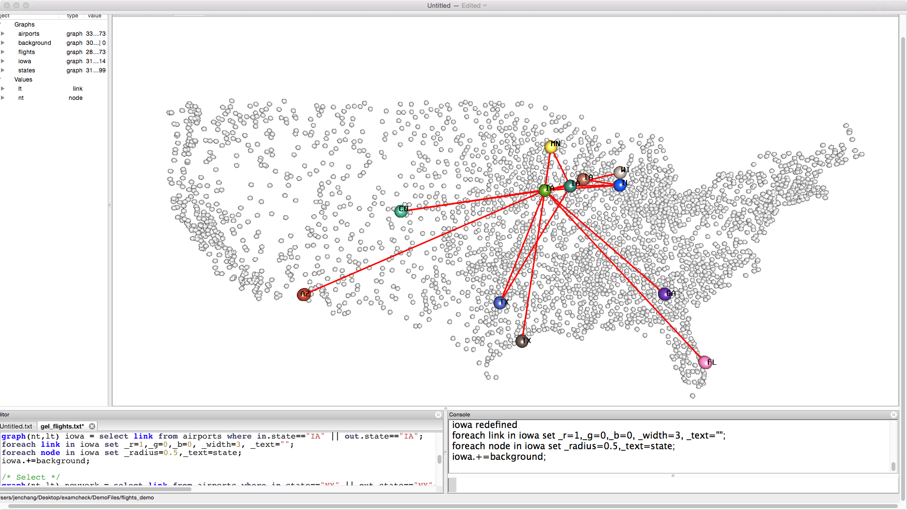

```
graph(nt,lt) newyork = select link from airports where in.state=="NY" || out.state=="NY";
foreach link in newyork set _r=0,_g=0,_b=1, _width=2;
foreach node in newyork set _radius=0.5,_text=state;
foreach node in newyork set _z=3; /* move newyork graph up 3 units */
newyork.+=background;
```

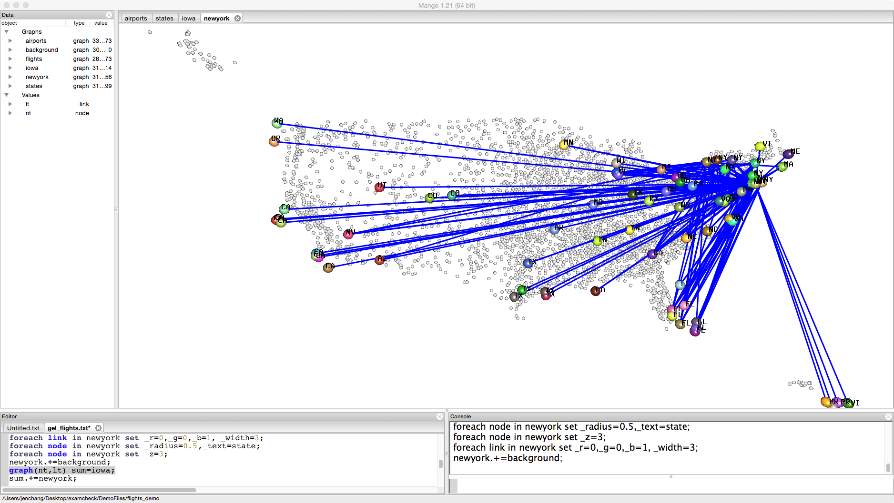

```
graph(nt,lt) sum=iowa;
sum.+=newyork;
```

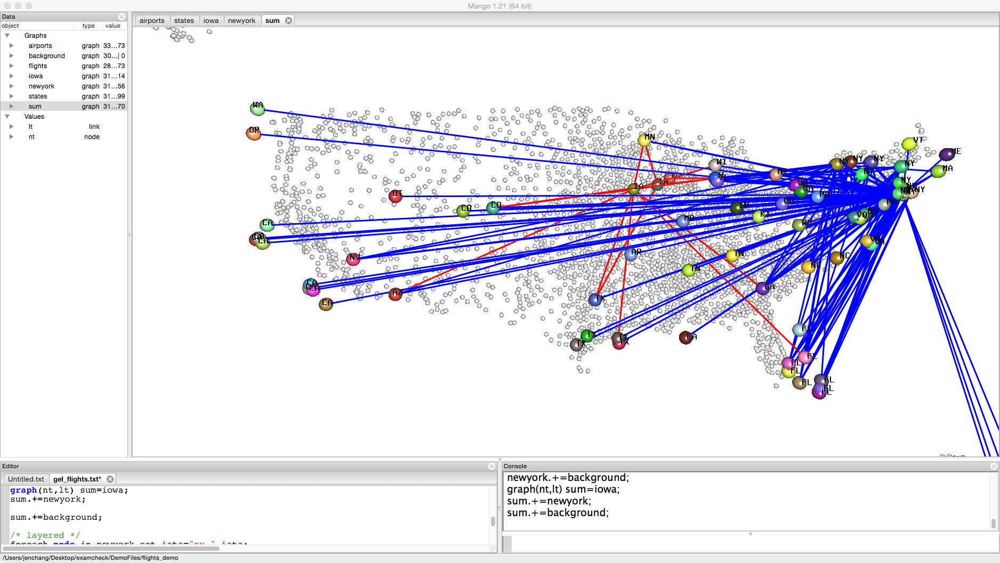

One layer is flights into and out of Iowa, the other layer is flights into and out of New York.


##Infection 

So far we've been visualizing a static properties of a loaded graph. Now we're going to propagate values through a graph. Create the following propagation graph:

```
node(string iata, int step) pnt;
link[int temp] plt; /* important to add a temp variable here */

graph(pnt,plt) prop=airports;
foreach node in prop where (in+out)<1 set _r=0.3, _g=0.3, _b=0.3;
foreach node in prop where (in+out)>0 set _radius=0.2, _r=1,_g=1,_b=1,step=0,_text="";
foreach link in prop set _r=1,_g=1,_b=1,_width=0.5, temp=0;
```

Change the background color to black by going to **Window/Change Settings**. Background rgb values to 0, 0, 0. Foreground rgb to 1,1,1.

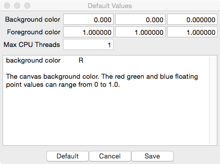

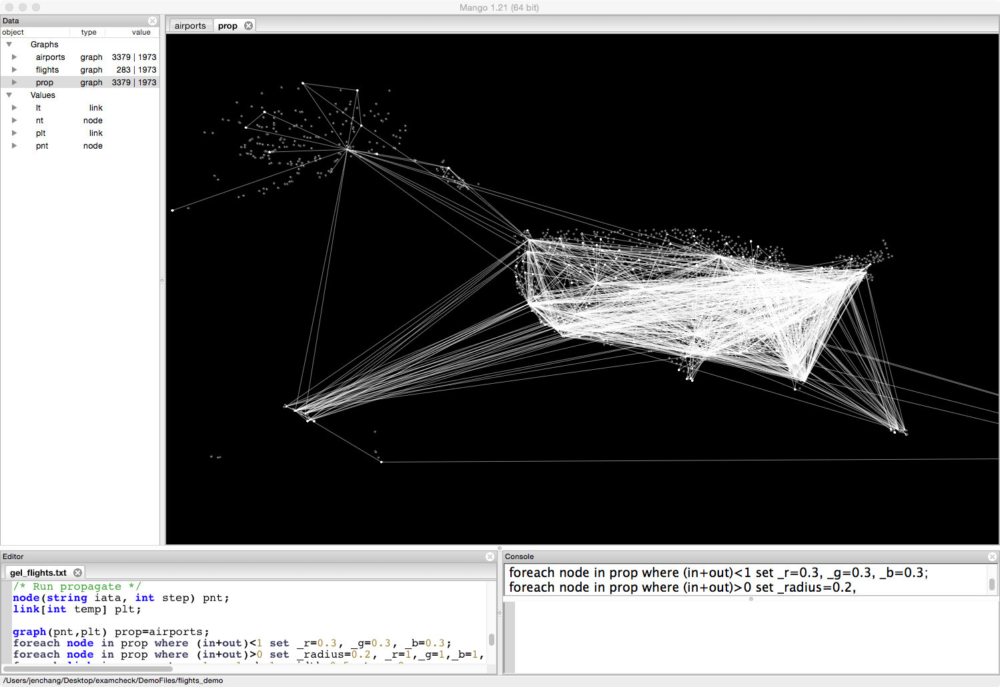

Let us infect one airport ADK and see how many steps (flights) it takes to hit all airports. This is an oversimplification but gives an example of how Mango can enable simulation thorugh a network. 

```
foreach node in prop where iata=="ADK" set _g=0, _radius=0.5, _text="0", step=0;
```

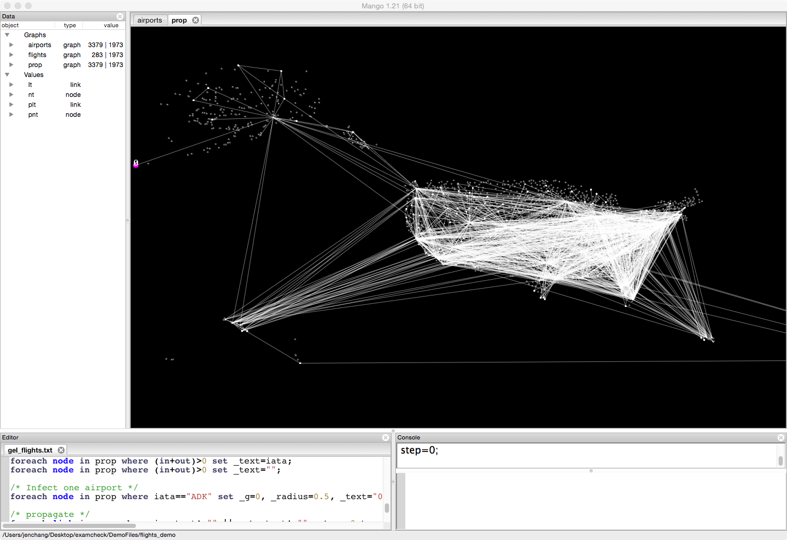

Highlight the following lines and run all at once in Mango to propagate values out. I've included images at each time step.
```
foreach link in prop where in._text!="" || out._text!="" set _g=0,temp=1,_width=1;

foreach link in prop where temp>0 && in._text!="" && out._text=="" set out._g=0,out._radius=0.5,out._text=in._text+1;
foreach link in prop where temp>0 && out._text!="" && in._text=="" set in._g=0,in._radius=0.5,in._text=out._text+1;

```

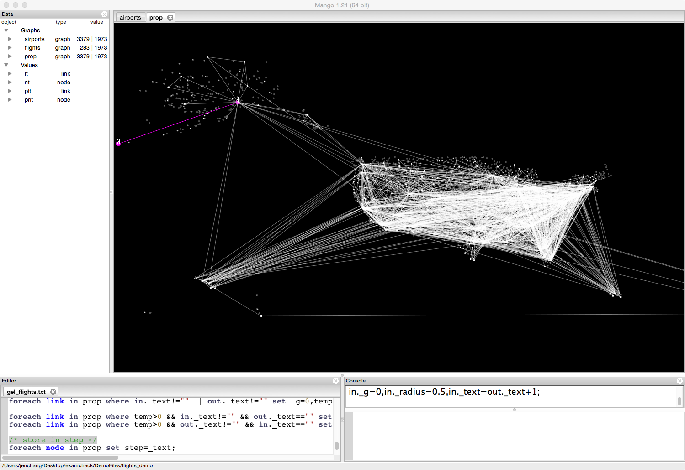

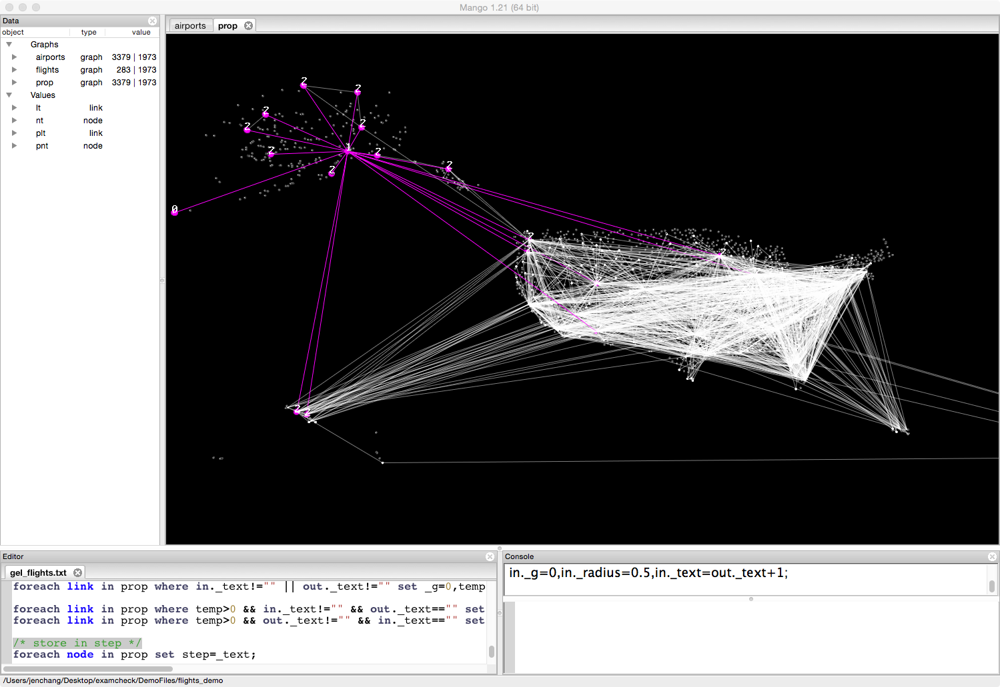

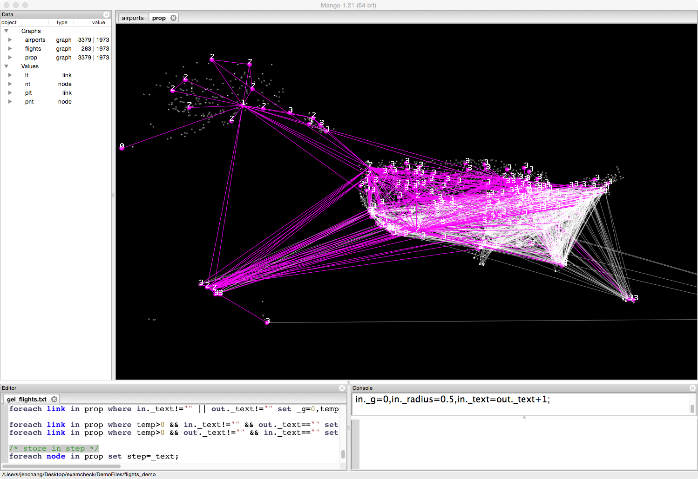

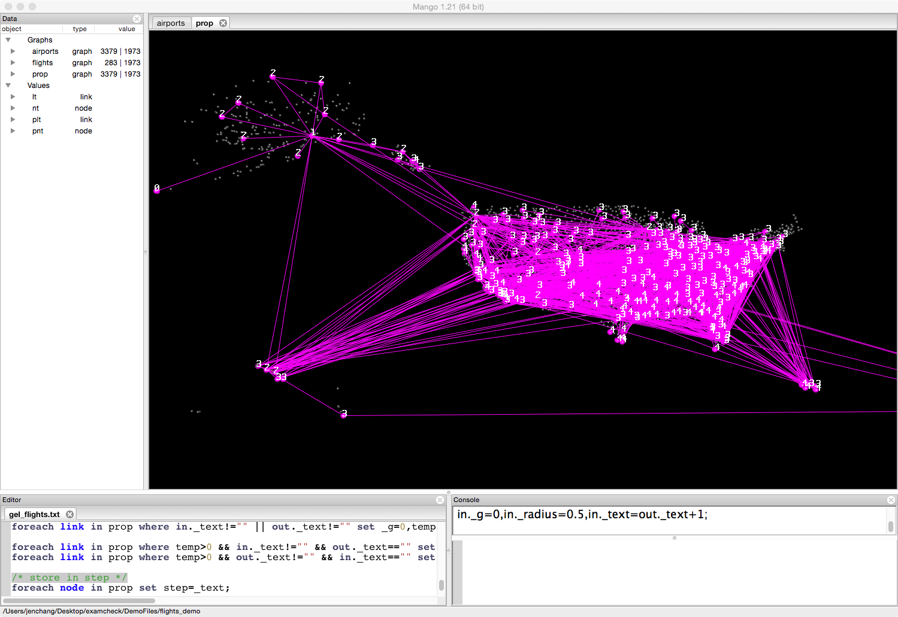

Finally store the number of steps away from ADK into the variable step, and use that to layout the graph in 3D, almost like a flow chart of the infection.

```
foreach node in prop set step=_text;

foreach node in prop where (in+out)>0 set _z=25-step*5-4;
foreach node in prop set _text="";
foreach node in prop where (in+out)>0 set _text=iata."_".step;
foreach node in prop where (in+out)>0 set _text=step;
```

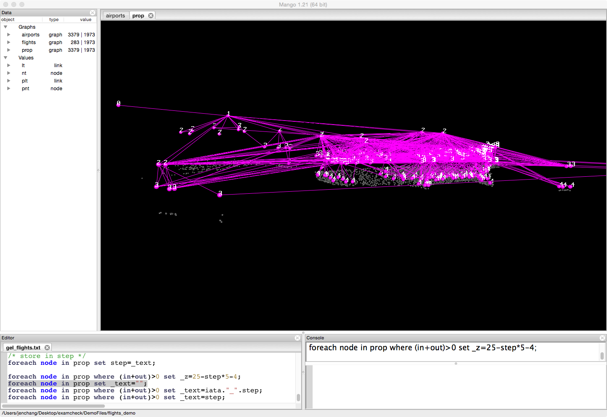

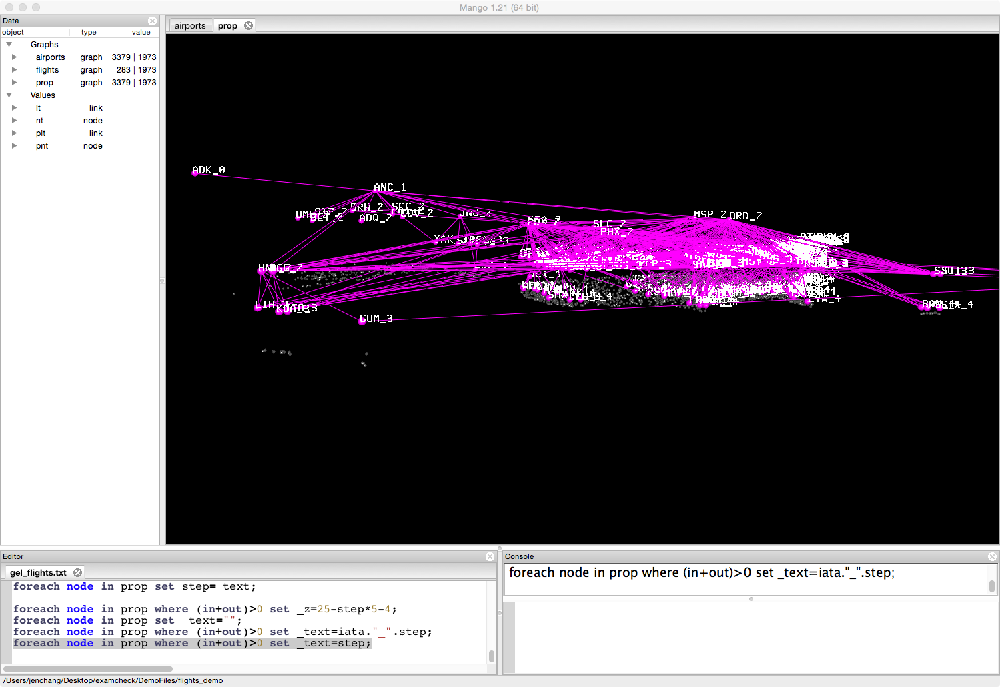


