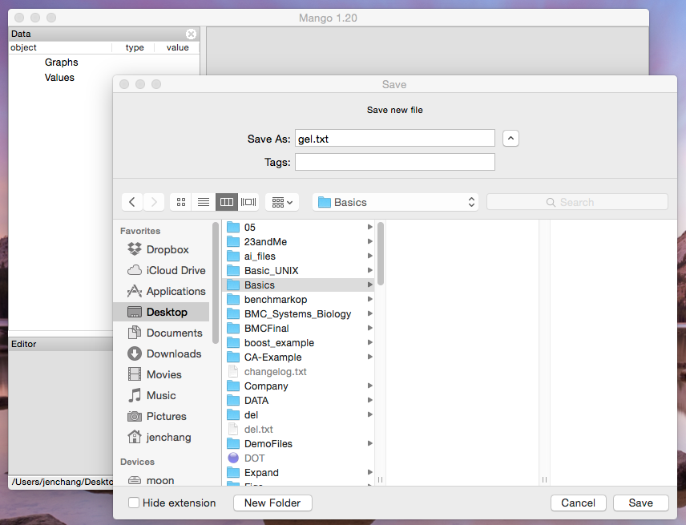
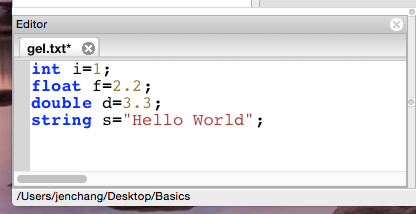
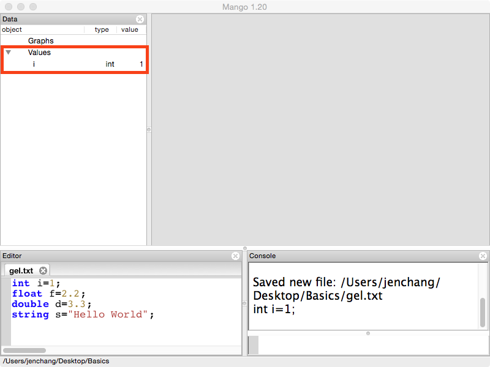
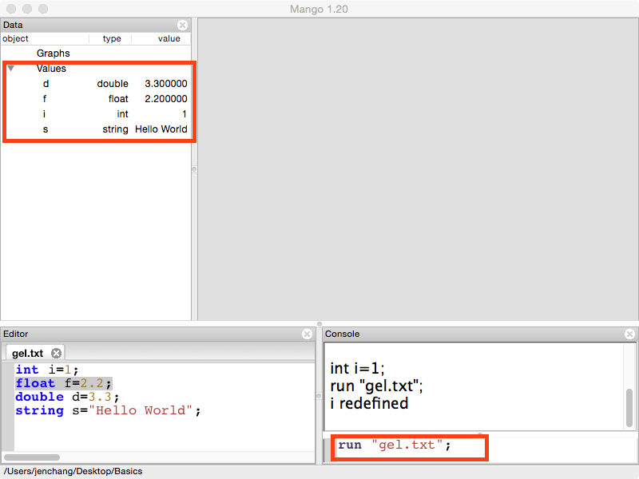
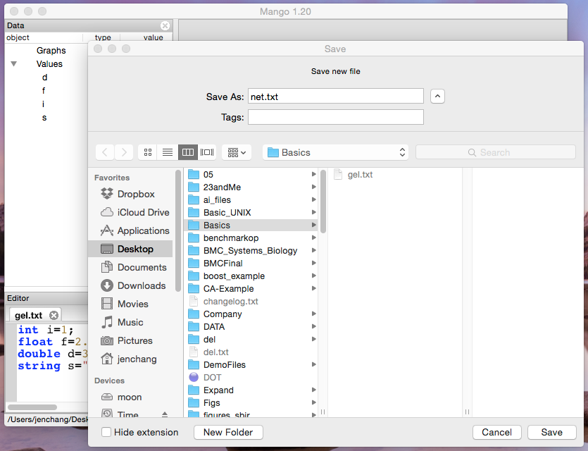
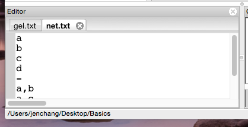
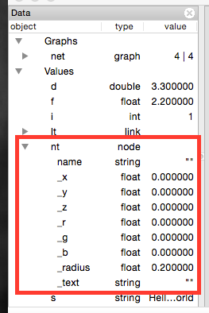
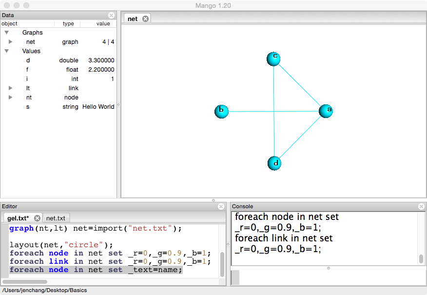

Walking Through the Mango Grove
================
This tutorial will walk you through creating a gel file and some basic network files from scratch. All you need is a running version of Mango since all code and text-based data will be in this tutorial.

Create a Gel File and the 4 Data Primitives
----
Open **Mango** and go to **File/New** or hit **Ctrl+N** to create a gel script. Create a new folder on your Desktop called **Basic** and name the new gel script "gel.txt". 



A new file should show up in the editor pane with a tab labeled "gel.txt". Type the following four lines into the gel.txt. 

```
int i=1;
float f=2.2;
double d=3.3;
string s="Hello World";
```

These are the four basic data types in Gel. 

When you start editing gel.txt, an asterisk symbol appears next the to the name in the tab. This means you have unsaved changes. Hit **Ctrl+S** to save file and notice how the asterisk goes away. 



Click inside of the gel.txt and place the cursor on the first line. Then press **Ctrl+Enter** and notice how it shows up under **Values** in the **Data** pane, listing data type and contents. 



You can either continue to press **Ctrl+Enter** to load the other data types or you can type the following command into the **Console** to run the entire file.

```
run "gel.txt";
```


Create a Network File and Load it
----
Go to **File/New** and create "net.txt". This file will store a small network. 



Network files can be imported as csv or other delimited text files. These can be exported from excel. The network files usually include a list of nodes, a hypen on it's own line, and a list of edges. Copy and paste the following text blocks into your net.txt and gel.txt files. In
**net.txt**
```
a
b
c
d
-
a,b
a,c
c,d
a,d
```


```
node(string name) nt;
link[] lt;
graph(nt,lt) net=import("net.txt");
```

Run the gel script and the object "net" shows up under Graphs in the Data panel. The "4|4" means net has 4 nodes and 4 links. Two other objects are created: nt, and lt. Click and expand the two.



Notice **nt** has string name with a bunch of other things listed with an underscore prefix. The prefixed attributes are called **system-defined attributes**. These are usually associated with the 3D layout or visualization of the network. Expand **lt** and take a look at the attributes. 

Change your net.txt file to look like the following:

```
a,10,red
b,20,red
c,30,blue
d,40,blue
-
a,b,0.1
a,c,0.5
c,d,0.8
a,d,0.2
```

Change your gel.txt to load new type of network file.

```
node(string name,int count,string type) nt;
link[float weight] lt;
graph(nt,lt) net=import("net.txt");
```
Expand the nt and lt. Expand graph and notice the nodetype and linktype. This is how you store a graph with different graph attributes. 

Visualize the loaded network
---
Double click "net" and a new tab shows up in the Graph Canvases area.


You only see one node because by default, all xyz coordinates are set to zero. Before we change them, run the following command five times:

```
print rand();
```
This will give a random float from 0 to 1. You can give two arguments for min and max values.

```
print rand(-5,5);
```

To change the layout let's try:

```
foreach node in net set _x=rand(-5,5),_y=rand(-5,5),_z=rand(-5,5);
```

Run a few times. Any of the attributes can be changed using the **foreach node** or **foreach link** command.

Gel provides a few preset layouts. These are all in the **layout** function. The first argument is the graph. The second argument is layout type "circle","random",or "cube". 

The following gives a circle layout and sets the color (RGB values) and turns on the text to display the node name.

```
layout(net,"circle");
foreach node in net set _r=0, _g=0.9, _b=1;
foreach link in net set _r=0, _g=0.9, _b=1;
foreach node in net set _text=name;
```



Loading multiple networks
---
net2.txt
```
# name,price
a,100
b,200
c,300
d,400
-
# to,from,time
b,c,2011
c,d,2010
a,b,2009
```

Save or Export the Network
----

