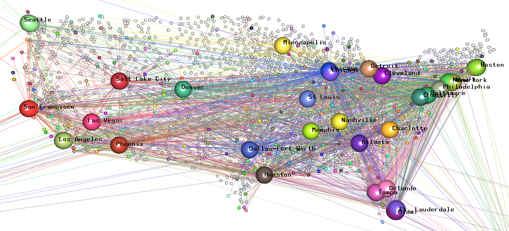
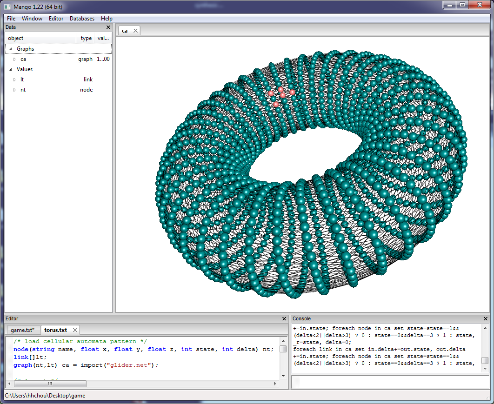
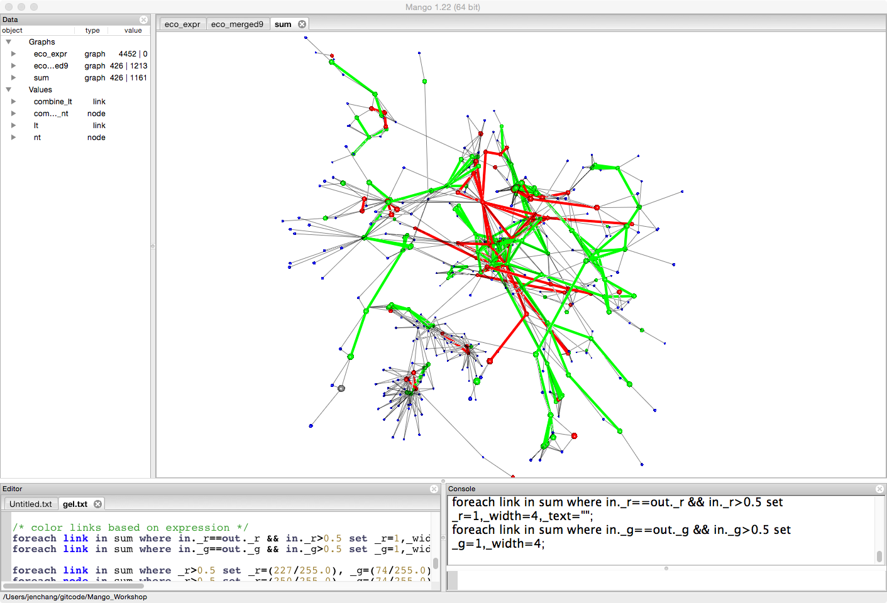

# Case Studies

## Airline Flights Example

**Description:** This example loads a airline flight network into Mango where nodes represent airports and links represent flights between airports. Since each airport contains logitude and latitude values, each airport can be mapped directly to xy space. The z axis then becomes a way to emphasize certain airports based on features. The final part of this example is creating a simulation of a spread of infection from one airport to the next. A static network becomes dynamic and some possible choices for visualizing the result.

## Cellular Automata Example

**Description:** Since Mango commands allows propagation of values, this is an example of simulating Cellular Automata models visually. Initially we create a 2D world with a particular pattern, then run Game of Life to observe the behavior of the system. Since in Cellular Automata, the top nodes connect to the bottom nodes and the left nodes connect to the right nodes, the world can be visualized as a 3D torus. Some perl scripts are included in this section to transform CA patterns into 3D networks.

## Gene Expression + KEGG Pathway

**Description:**

