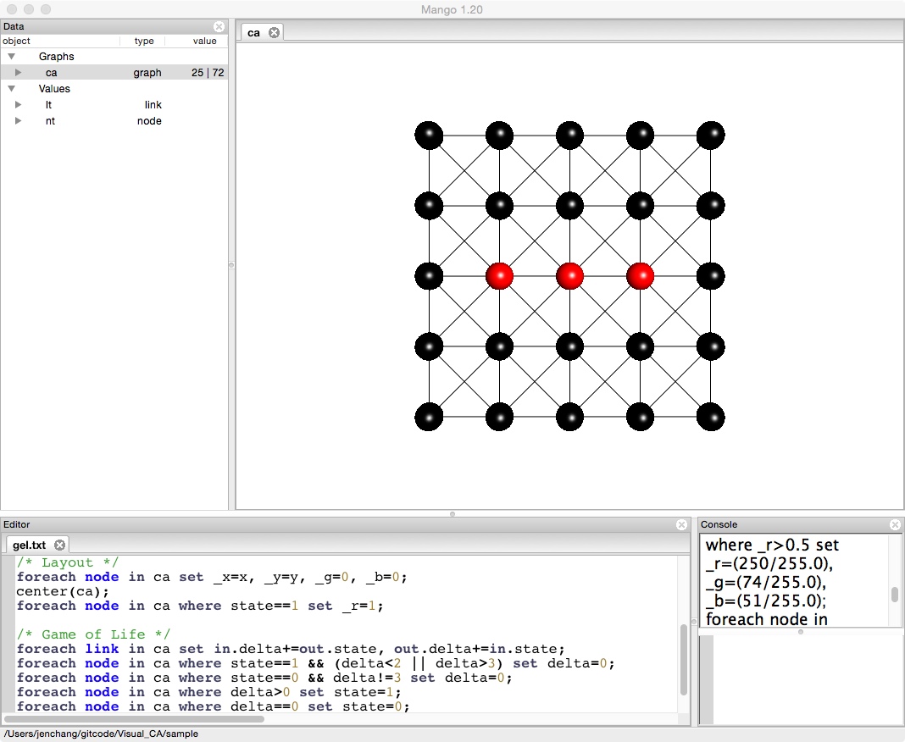
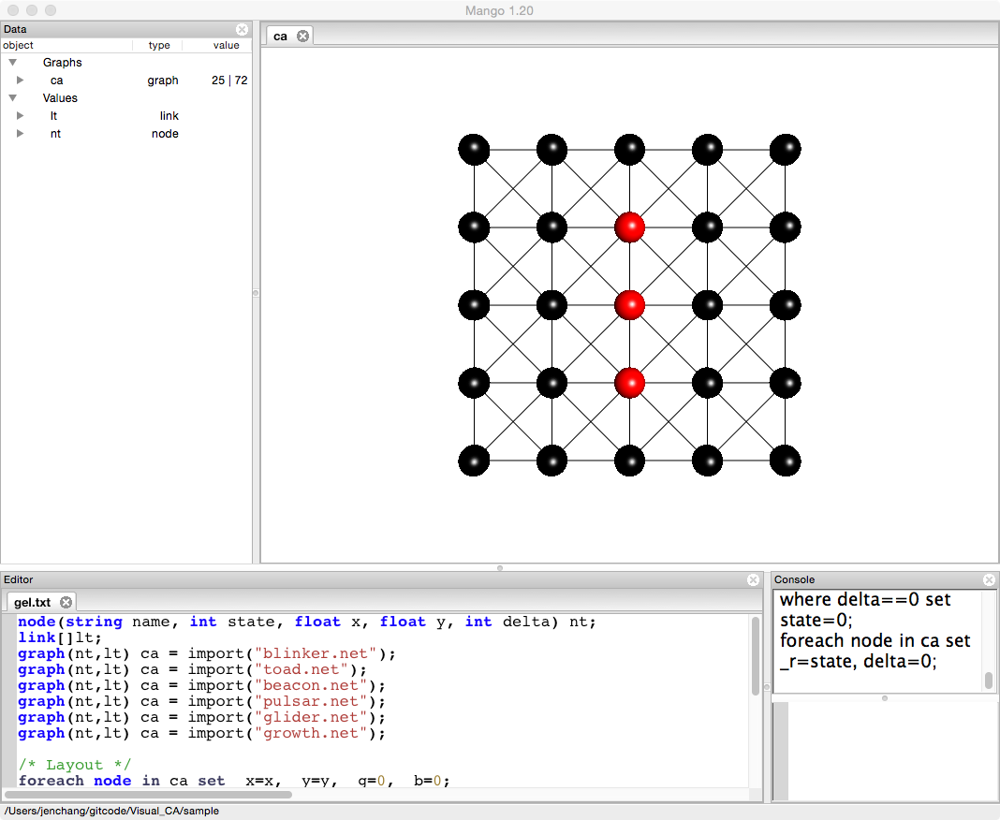
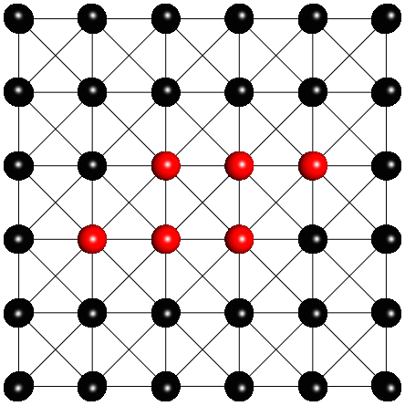
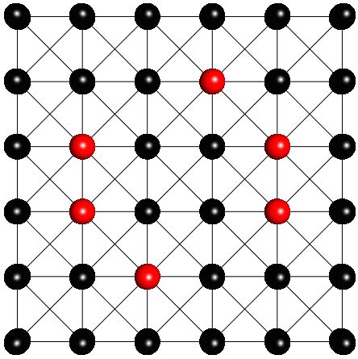
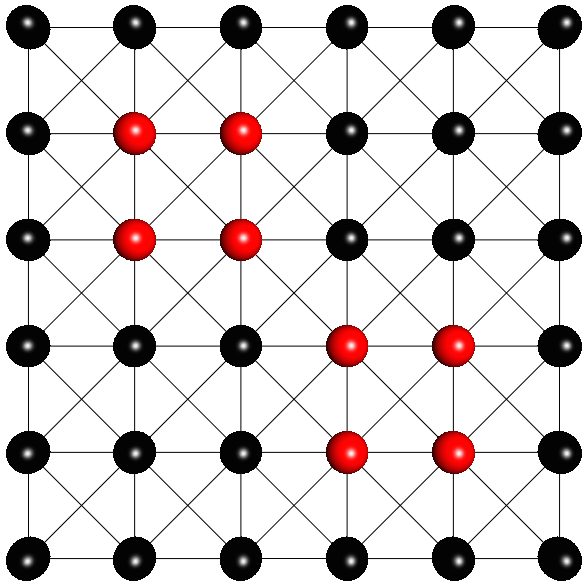
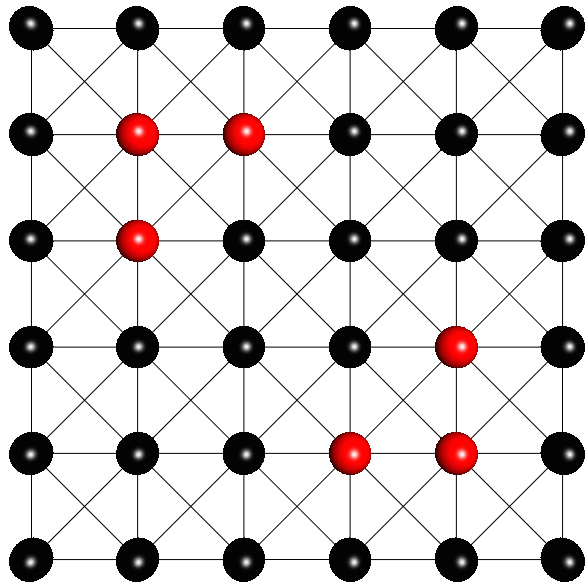
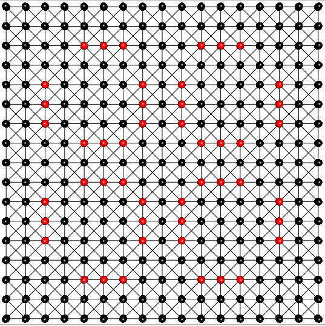
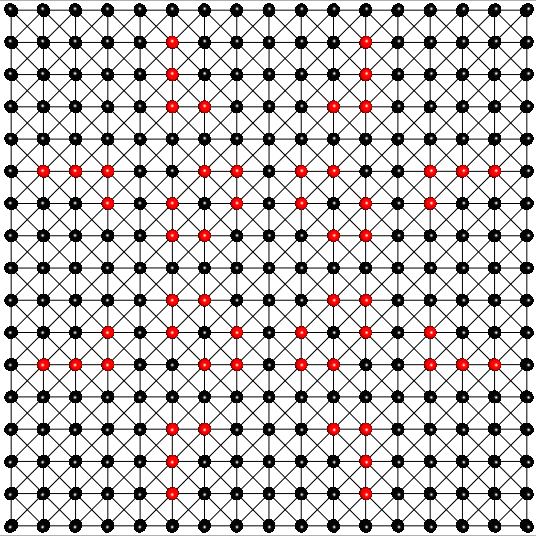
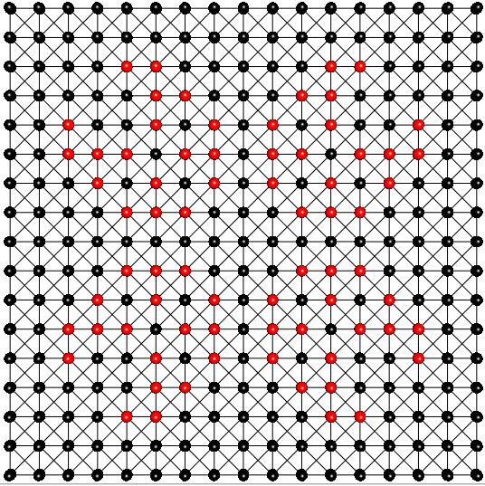

# Cellular Automata Example

**Outline**
* Creating a Cellular Automata Network
* Game of Life

Mango can be used to visualize Cellular Automata where each cell is a node and neighbors are linked together. This is an example using scripts and patterns at the following github page:

https://github.com/j23414/Visual_CA.git

In cellular automata, a cell is in one of a finite set of states (often either alive, or dead). At each epoch, or time step, the next state is determined the by the current state of its immediate neighbors. 

Often you are definining an intial pattern and then run it for a few steps to notice if there is a loop or some complexity arising from a simple set of rules. 

##Creating a Cellular Automata Network
For example, there is the blinker pattern where 0 represent dead and 1 represents alive:

```
0,0,0,0,0
0,0,0,0,0
0,1,1,1,0
0,0,0,0,0
0,0,0,0,0
```

I have provided a perl script to convert this pattern to a Mango readable network:

```
#! /usr/bin/perl

use strict;
use warnings;

my $id=0;
my $x=0; 
my $y=0;

my @nodes;

while(<>){
    chomp;
    @nodes = split(/,/);
    $x=0;
    foreach my $state (@nodes){
        print "n".($id++).",$state,".($x++).",".($y*-1)."\n";
    }
    $y++;
}
print "-\n";
my $i; my $j;
for($i=0; $i<$y; $i++){
    for($j=1; $j<$x; $j++){
        print "n".($i*$x+$j-1).",n".($i*$x+$j)."\n"; # -
        if(($i*$x+$j-1)-($x)>=0){
            print "n".($i*$x+$j-1-$x).",n".($i*$x+$j-1)."\n"; # |
            print "n".($i*$x+$j-$x).",n".($i*$x+$j-1)."\n";   # /
            if($j>0){
                print "n".($i*$x+$j-1-$x).",n".($i*$x+$j)."\n"; # \
            }
        }
    }
    if(($i*$x+$j-1)-($x)>=0){
        print "n".($i*$x+$j-1-$x).",n".($i*$x+$j-1)."\n"; # | last
    }
} 

for(my $i=0; $i<$x; $i++){
    for(my $j=1; $j<$y; $j++){
        print "n".($i*$y+$j-1).",n".($i*$y+$j)."\n";
    }
} 
```

Run the following to generate the network file

```
perl pattern2net.pl blinker.txt > blinker.net
```

Within Mango, navigate to the folder containing the files you cloned from the github site. Open the gel.txt file and run the top commands to load blinker.net and set default layout:

```
/* load cellular automata pattern */
node(string name, int state, float x, float y, int delta) nt;
link[]lt;
graph(nt,lt) ca = import("blinker.net");

/* layout */
foreach node in ca set _x=x, _y=y, _g=0, _b=0;
center(ca);
foreach node in ca where state==1 set _r=1;
```



## Game of Life

To run one step, select and run the following lines:

```
/* Game of Life */
foreach link in ca set in.delta+=out.state, out.delta+=in.state;
foreach node in ca where state==1 && (delta<2 || delta>3) set delta=0;
foreach node in ca where state==0 && delta!=3 set delta=0;
foreach node in ca where delta>0 set state=1;
foreach node in ca where delta==0 set state=0;
foreach node in ca set _r=state, delta=0;
```

 

Rerun that comand to continue to blink back and forth between the patterns. Other patterns such as  toad, beacon, pulsar, glider, growth are provided. 

## Patterns

###toad.net
<div style="width:200px">
   
<div style="width:200px">


###beacon.net
<div style="width:200px">

<div style="width:200px">


###pulsar.net
<div style="width:400px">

<div style="width:400px">

<div style="width:400px">
