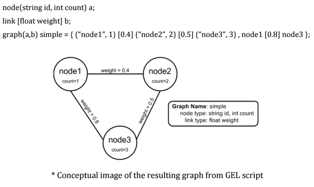

# GEL Data Structures

GEL provides four basic data primitives *string*, *int*, *float*, and *double* as well as aggregate data types *node*, *link* and *graph*. Understanding these basic data types and their behaviors has helped standardize the way we work with heterogeneous graphs.

#Graphs

\* The terms *network* and *graph* will be used interchanably. 

From **graph theory**, a graph is defined as a set of nodes and links. 

* **Nodes:** represent entities that are identified by unique strings or numbers

* **Links:** represent relationships between a pair of entities and are identified by the pair of nodes it connects. 

For example the following simple graph is represented by the set of nodes **\{a, b, c, d\}** and the set of links **\{ab, bc, ac, ad\}**

\center{
}

A graph is defined as a set of nodes and edges. A set of people and their friend network. Or a set of towns and the interconnected highway system. Therefore, when designing a graph data type, we must have a way to identify nodes and links.  Nodes can be identified by unique names. Gel uses string ids, unlike other programs which uses a unique number id. This reduces the mapping from name to number that is required when comparing nodes in multiple graphs. 

Since links connect pairs of nodes, links are identified by the pair of node names. 

The major strength of Mango is that it can also deal with graph attributes. Nodes and links may have a set of attributes associated with them. For example, in a social network, an individual named "Bob" may have an age, birth date, home address, height and weight. 

