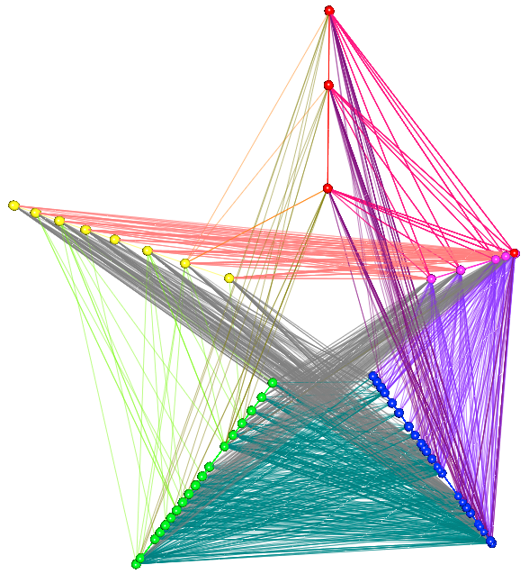

# Graph Layouts

Each node in a graph has the following system variables for xyz coordinates.

```
_x
_y
_z
```

Therefore you can directly modify these node attributes to create customized layouts.

## Create a Random Network

```
foreach node in graph set _x=rand(-10,10),_y=(-5,5), _z=rand(-2,2);
```

## Default Layouts

```
layout(graphname, "circle");
layout(graphname, "random");
layout(graphname, "cube");
```

## Hive Plot Example



```
/* hive plot, 5 groups */
int i;
float f;
foreach node in flights set i=log(in+out),f=rand(1,10), _y=sin(2*3.14/5*i)*f, _x=cos(2*3.14/5*i)*f;
foreach node in flights set i=(log(in+out)),f=rand(1,10), _y=sin(2*3.14/5*i)*10*(log(in+out)-i+0.8), _x=cos(2*3.14/5*i)*10*(log(in+out)-i+0.8);

/* coloring */
foreach node in flights where log(in+out)<2.49 || log(in+out)>4.51 set _r=1;
foreach node in flights where log(in+out)>=1.49 && log(in+out)<3.50 set _g=1,_b=0;
foreach node in flights where log(in+out)>=3.50 && log(in+out)<5.50 set _b=1;
foreach link in flights set _r=(in._r+out._r)/2.0,_g=(in._g+out._g)/2.0,_b=(in._b+out._b)/2.0; 

```

## Crown Plot Example

```
layout(graphname, "circle");
foreach node in graphname set _z=(in+out)/5.0;
```

## Direct Map Example

```
foreach node in airports set _x=long, _y=lat, _z=0;
center(airports,"DEN");
```

## Bipartite Graph Example

```
foreach node in bipartite where group=="1" set _x=-5, _y=rand(-5,5),_z=0;
foreach node in bipartite where group=="1" set _x=5, _y=rand(-5,5),_z=0;
```

