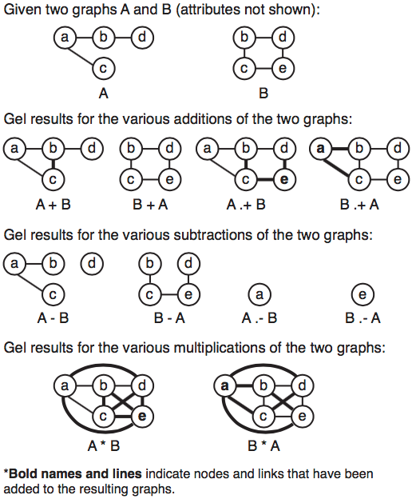

# Graph Mathematics

A Suppose you have two graphs called A and B. 

One of the strengths of Gel is it's set of graph mathematics. This allows you to combine and compare many heterogeneous graphs in a typed command.

What might you want to do with two graphs? You may want to combine them together. Thus we have graph addition. 

```
graph(nt,lt) A;
graph(nt,lt) B;

graph(nt,lt) C = A-A;
```
What do you expect to happen? Try the code. Your results should be similar to those below.

Notice how *A-A* resulted in graph *A* with no links. That is because '-' and '+' results in subtraction and addition of links. To subtract and add nodes put a dot '.' in front of the operators. 

```
graph(nt,lt) C = A.-A;
```

This results in the empty graph.



