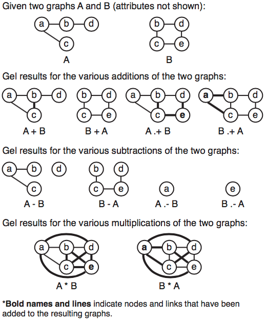

# Graph Mathematics

One of the strengths of Gel is its set of graph mathematics. Graph mathematics allow you to combine and compare many heterogeneous graphs. Each graph is treated as a unit that can be added, subtracted, or otherwise combined with each other. Gel takes care of the complications of graph attribute conflicts and merging. 

What might you want to do with two graphs? You may want to combine them together. 

$$x \in y$$

```
graph(nt,lt) A;
graph(nt,lt) B;

graph(nt,lt) C = A-A;
```
What do you expect to happen? Try the code. Your results should be similar to those below.

Notice how *A-A* resulted in graph *A* with no links. That is because '-' and '+' results in subtraction and addition of links. To subtract and add nodes put a dot '.' in front of the operators. 

```
graph(nt,lt) C = A.-A;
```

This results in the empty graph.



Graph mathematics allow graph level operations. When two graphs are combined, node and link attributes must be combined in an intuitive manner. What happens when node and link attribute conflict occurs. The graph on the left (left operand) values take precedence. The exception to this is if the left operand has default values. Then the new data from the right will be incorporated into the new resulting graph.