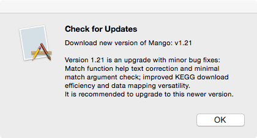

## Installation

Install **Mango** by going to http://www.complex.iastate.edu/download/Mango and registering a free account. You will receive an email shortly with your new password. Use your email and new password to log into the download area and select the installation file for your operating system. 

* Windows 7 and later - setup.exe
* Mac 10 and later - Mango.dmg
* Linux Redhat variants - Mango.zip

For a full walk through see the following videos.

* **Windows:** https://youtu.be/Y0Zpj1SyTr8
* **Mac:** https://youtu.be/bsC462EiMu8
* **Linux:** https://youtu.be/9_cWjHFyZDQ

###Check for Updates

Mango is under active development so make sure to check for updates regularly. Go to **Help/Check for updates...**. You will need an internet connection in order for Mango to query the latest version. If a newer version of Mango is available a window similar to the following will show up:

Visit the software website to download the newest version. 

Otherwise a window will pop up and tell you your current version is up to date. 

### User Interface

You can increase the font size for the console and the editor using Ctrl++ on Windows and Linux or Cmd++ on Mac. Use Ctrl+- or Cmd+- to decrease font. Click and drag headers of Editor and Console if you want to rearrange the panes on the screen.