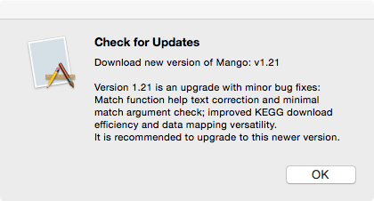

## Installing Mango

Mango is a stand-alone c++ application and installers can be downloaded for Windows, Mac, and Linux. **You DO NOT have to compile anything.**

1. Visit http://www.complex.iastate.edu/download/Mango.
2. Scroll down the page, and register a free account by entering an email address.
3. Soon after, you will receive an email with your new password.
4. Use your password and the email address to log into the the Download area and select the instalation for your operating system. 
  * Windows 7 and later - setup.exe
  * Mac 10 and later - Mango.dmg
  * Linux Redhat variants - Mango.zip

A full walk-through of Mango installation steps is posted to YouTube:

* **Windows:** https://youtu.be/Y0Zpj1SyTr8
* **Mac:** https://youtu.be/bsC462EiMu8
* **Linux:** https://youtu.be/9_cWjHFyZDQ

###Mango v1.24 and later

Since August 2016, Mango has been licensed for continued development to Complex Computation, LLC. A free community version will always be made available.

1. Visit http://www.complexcomputation.com
2. Go to Mango/Download Mango from the Menu
3. Add Mango v#.## Community Edition to your cart
4. Register a FREE account using your email and address as billing information
5. Wait for confirmation email and download installer for your particular operating system

### Version Updates

Mango is under active development so it is important to check for updates regularly. 

1. Open Mango
2. On the menu bar, open **Help/Check for updates...**
3. You will need to be connected to the internet. If a new version of Mango is available, a message box will pop up:

  
4. Visit http://www.complex.iastate.edu/download/Mango and repeat installation steps above. 

### Customizing the user interface

**Font Size**

You can increase the font size for the console and the editor using Ctrl++ on Windows and Linux or Cmd++ on Mac. Use Ctrl+- or Cmd+- to decrease font. This will not increase the font size of node or link labels.

**Panel Layout**

Click and drag headers of Editor and Console if you want to rearrange the panes on the screen.