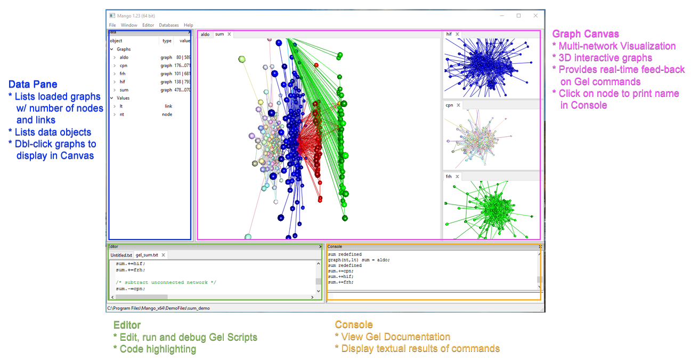

## Installation

Mango is a stand-alone C++ application and installers can be downloaded for Windows, Mac, and Linux. **You DO NOT have to compile anything.** 

In January 2014, [Hui-Hsien Chou](http://www.complex.iastate.edu/staff/chou.html) and [Jennifer Chang](https://github.com/j23414) started developing Mango, the graph exploration system, while at [Iowa State University](https://www.iastate.edu). Since August 2016, Mango has been licensed and trademarked as "Mango Graph Studio" for continued development to [Complex Computation, LLC](https://www.complexcomputation.com/en). A community version of Mango will always be freely available.  A professional version of Mango Graph Studio is in development.

###Install Mango Graph Studio v1.24 and later

1. Visit [https://www.complexcomputation.com/en/download-mango/](https://www.complexcomputation.com/en/download-mango/)
2. Add **Mango Community Edition** to your cart
3. Register a free account using your email and address as billing information
4. Wait for confirmation email and download installer for your particular operating system
  * Windows 7 and later - setup.exe
  * Mac 10 and later - Mango.dmg
  * Linux Redhat variants - Mango.zip

###Install pre-Mango v1.24 versions 
1. Visit [http://www.complex.iastate.edu/download/Mango](http://www.complex.iastate.edu/download/Mango).
2. Scroll down the page, and register a free account by entering an email address.
3. Soon after, you will receive an email with your new password.
4. Use your password and the email address to log into the the Download area and select the instalation for your operating system. 
  * Windows 7 and later - setup.exe
  * Mac 10 and later - Mango.dmg
  * Linux Redhat variants - Mango.zip

A full walk-through of Mango installation steps is posted to YouTube:

* [**Windows Installation**](https://youtu.be/Y0Zpj1SyTr8)
* [**Mac Installation**](https://youtu.be/bsC462EiMu8)
* [**Linux Installation**](https://youtu.be/9_cWjHFyZDQ)

## First time running Mango Graph Studio 

### Running Mango Graph Studio on Mac Computers

The security settings on Mac may require you to first right click on the application and then select run. It will give you a warning that Mango Graph Studio does not have a apple developer certificate. Click on **Open** anyway and the application will run. 

If you only left click on Mango Graph Studio, the same warning will pop up but without an **Open** button. 

### Version Updates

Mango Graph Studio is under active development so it is important to check for updates regularly. 

1. Open Mango Graph Studio
2. On the menu bar, open **Help/Check for updates...**
3. You will need to be connected to the internet. If a new version of Mango is available, a message box will pop up:

  
4. Install a new version by repeating the steps of installation above.

### The User Interface

The user interface for Mango Graph Studio is designed to ease multi-network analysis. Each loaded network is listed in the **Data Pane** along with number of nodes and links. When you double click a network name, the network is displayed in the **Graph Canvas**. Each network is 3D interactive. Each tab can be dragged around to view multiple networks at the same time. 

 

The **Editor** allows the user to edit and run the Graph Exploration Language (Gel) scripts. Gel scripts allows for documentation and reproducible multi-network analysis. Any textual results are displayed in the **Console**. The console displays any help or error messages. The user can also send in print statements. If the user clicks on a node in the Graph Canvas, the node ID is printed in the Console.

### Customizing the user interface

**Font Size**

You can increase the font size for the **console** and the **editor** using Ctrl+= on Windows and Linux or Cmd+= on Mac. Use Ctrl+- or Cmd+- to decrease font. 

Note that the code font will increase while the text in the data panel and the graph canvas will remain the same. This will not increase the font size of node or link labels.

**Panel Layout**

Click and drag headers of Editor and Console if you want to rearrange the panes on the screen.

**Graph Canvas Settings**

You can customize the visualization in the Graph Canvases by going to the menubar: 

Window -> Change Settings

**Background color** changes the RGB (Red, Green, Blue) values of the background. 

**Foreground color** changes the text color of node or link labels. 

When a user clicks on a node in the Graph Canvas, the node is selected and changes to the **Selected node color** while its label changes to the **Selected text color**.

**Max CPU Threads** is by default 1 thread. 
