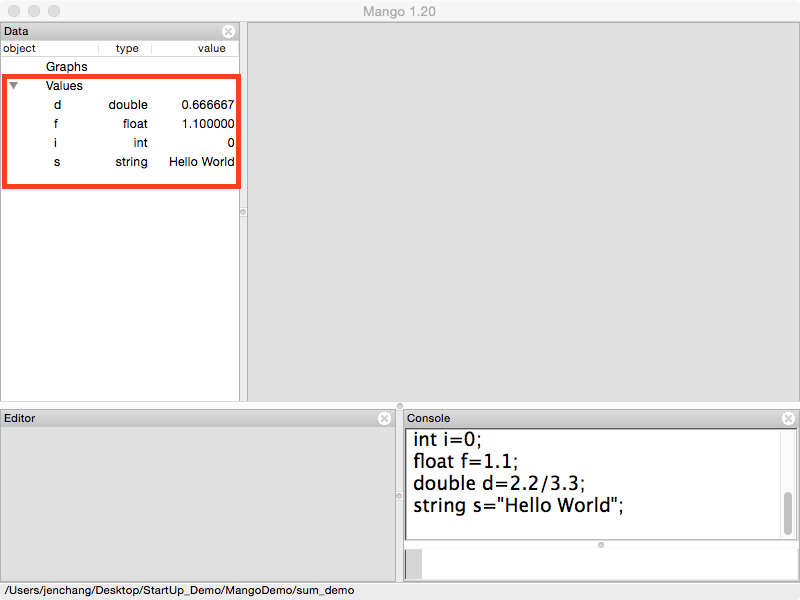

# 4 Data Primitives

GEL has **4 data primitives**
1. **integers**
2. **doubles**
3. **floats**
4. **strings**. 
 
Type the following commands into Gel console, pressing Enter/Return after each semicolon. 

```
int i = 0; 
float f = 1.1;
double d = 2.2 / 3.3;
string s = "Hello World";
```
Notice how each data primitive is displayed in the Data pane listing type and value. 



**Watch Out!**

floats and doubles must have at least one number before the decimal point.

```
/* will throw errors */
float f = .1;
double d = .2;

/* must be */
float f = 0.1;
double d = 0.2;
```

Use the **print** and **desc** commands to display the values of data objects in the **Console** panel. Their behaviors are subtly different.

```
/* print displays strings and data objects */
print i;
print "I have 3 apples";
print "var: i=",i, " f=", f, " d=", d, " s=", s;

/* desc only displays data objects */
desc f;
desc i,f,d,s;
desc "hi";     /* this will throw an error */
desc;          /* this will print all data objects */
```

Look at data panel...

Gel contains **basic mathematical expressions** such as addition, subtraction, multiplication and division with order of operations. Run the following commands;

```
print 1 + 2;
print 3.5 - 4;
print 4 * 5;
print 4/3;     /* division of two int's gets rounded */
print 4.0/3;   /* division of float and int returns float */
print 5 + 4 * 6;
print (5 + 4) * 6;
```
When passing an expression to **float** and **double**, you must specify **at least one decimal place** or results will be converted to an int. Multiple commands can be executed on the same line, as long as they are separated by a semicolon.

```
f = 3/2; desc f;   /* f = 1   */
f = 3/2.0; desc f; /* f = 1.5 */
d = 1/2; desc d;   /* d = 0   */
d = 1.0/2; desc d; /* d = 0.5 */
```

Conversions from **double** or **float** to an **integer** results in rounded values. 

```
/* float converted to an int is rounded to nearest int */
f=3.2; i=f; desc i,f;  /* round down */
f=3.5; i=f; desc i,f;  /* round up  */
f=3.8; i=f; desc i,f;  /* round up  */

/* double converted to an int is rounded to nearest int */
d=4/3.0; i=d; desc i, d;
d=5/3.0; i=d; desc i, d;
```

Generate random numbers using the **rand()** command. Run each command a few times in a row, using the **up-arrow key** to recall the last command. 

```
print"rand(-5,5)=",rand(-5,5);  /*random double between -5 and 5*/
print"rand(0,10)=",rand(0,10);  /*random double between 0 and 10*/
print"rand()=",rand();          /*random double between 0 and 1 */
d=rand(0,10); desc d;           /*assigns random double to doubled*/
f=rand(0,10); desc f;           /*assigns random double to float */
i=rand(0,10); desc i;           /*rounds the random number to int */
```

Conversions from **numbers to strings** will result in a string version of the number, not the character encoding.

```
strings=4;         /*results in the string "4"*/
desc s;
s=4+5;     desc s; /*the result is stored in s*/
s="4+5";   desc s; /*the string "4+5" is stored in s*/
f=4;s=f+5; desc s; /*result of expression is stored in s*/
```

Gel will attempt to convert a **string to numeric** values but if it fails, the numerical
value will be 0.

```
strings="4"; int i=s; desc i,s; /*int i=4*/
strings=" 4"; int i=s;desc i,s; /*int i= 4 despite spaces*/
strings="a4"; int i=s;desc i,s; /*int i=0 because it can’t converts*/
strings="4pigs"; int i=s; desc i,s; /*int i=4 and drops "pigs"*/
/*similarbehaviorinfloatanddouble*/
strings=”4.1pigs”;doubled=s;descd,s;/*doubled=4.1anddrops“pigs”*/
```

**Strings can be concatenated** together using "+" and ".".

```
string a="Hello "; string b="World";
string s=a+b; desc s; /*both result in string “Hello World”*/
string s=a.b; desc s;
```

Integers
--
Integers are whole numbers such as ...-4,-3,-2,-1,0,1,2,3,4... In Gel, integers are defined with the **int** keyword and name of the variable.

```
int i;
int count;
i = 1;
i = 1 + 2;
```

Floating point numbers such as **floats** and **doubles** are rounded (up or down) to the nearest integer when assigned to an int.

```
int i = 2.3;  /* i = 2 */
int i = 2.5;  /* i = 3 */
int i = 2.8;  /* i = 3 */
```
When assigned to an integer variable, Gel will attempt to convert **strings** to a numeric value. If the string is a number such as "30", the number 30 will be stored as an int. If the string cannot be converted into a number, then zero will be stored in the int. 

```
int i = "30";     /* i = 30 */
int i = "hello";  /* i = 0 */
```
The same rounding rules apply from **floats** and **doubles**.
```
int i = "3.3";    /* i = 3 */
int i = "3.8";    /* i = 4, due to rounding up */
```
If the string contains a number as a prefix, the number will be stored as an int while the rest of the string will be ignored. The same is not true if the number is at the end of the string.
```
int i = "3 pigs"; /* i = 3 */
int i = "run 4";  /* i = 0 */
```

Floats and Doubles
---

Floats are numeric values that can have decimal precision such as 2.3, 4.55, and -204.808. Doubles have twice the decimal precision than floats. Floats and doubles are defined with the **float** and **double** keywords respectively.

```
float f;
float weight;

double d;
double milligrams;

f=2.3;
d=3.3/4.4;
```

During assignment, values must have at least one number to the left of the decimal place.

```
/* does not work */
float f = .1;
double d = .5; 

/* must use */
float f = 0.1;
double d = 0.5;
```

When assigning mathematical expressions to a float or a double, rounding might occur. This happens if none of the numbers have at least one number to the right of the decimal place.

```
float f = 4/3;   /* f = 1 */
float f = 4.0/3; /* f = 1.333... */ 

double d = 4/3;   /* d = 1 */
double d = 4.0/3; /* d = 1.333... */ 
```

