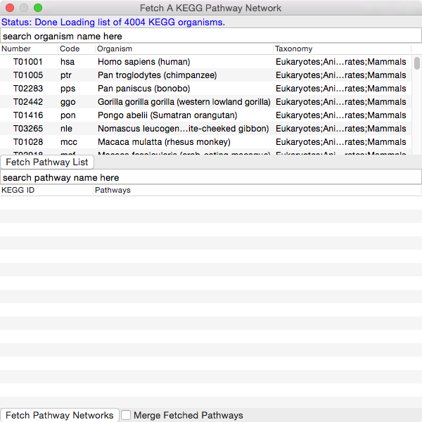
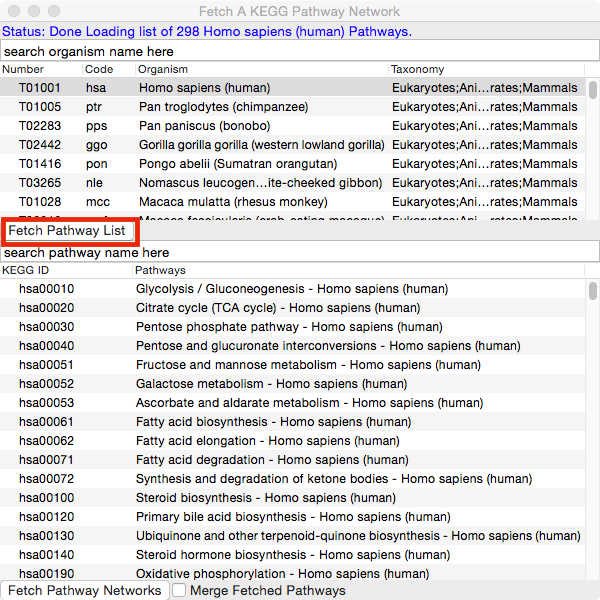
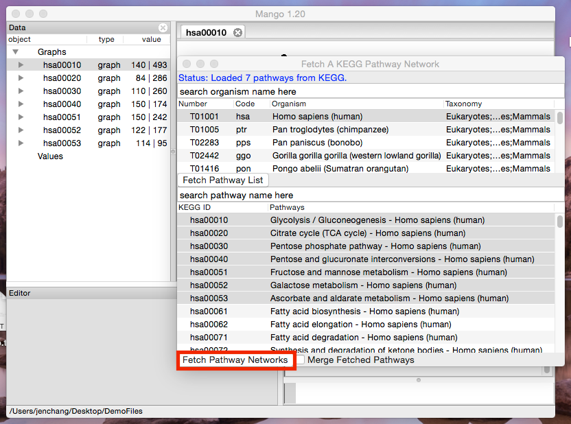
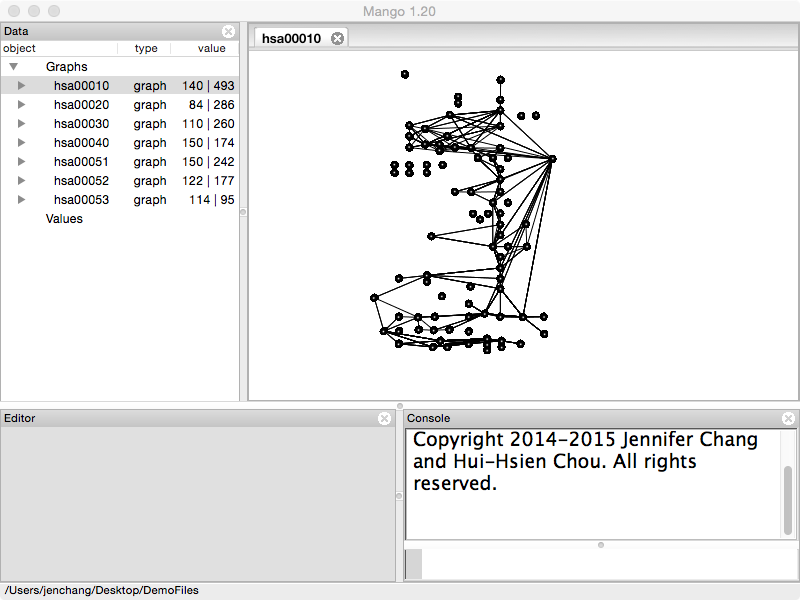
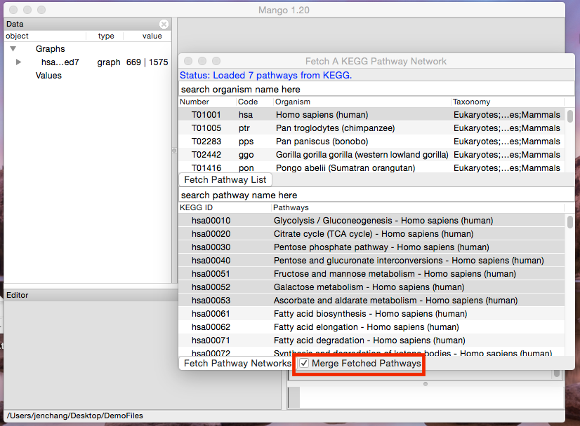
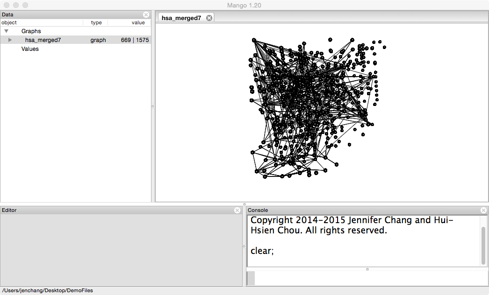

# KEGG

Open **Mango** and click on **Databases/KEGG** in the menu.

<!--
 -->

A dialog window will pop and attempt to connect to KEGG database. It will take around a minute for a list of organisms to be shown in the first list. 

Select an organism from the list so it's highlighted and then click the **Fetch Pathway List** button. 

Select one pathway (click) or multiple pathways (ctrl+click, or shift+click) and hit the **Fetch Pathway Networks** button.

Each will be KEGG pathway will be loaded as a separate network.

Double click the pathway and notice how it retains the original xy coordinates from KEGG.

Open the KEGG dialog window again, and this time check the box next to **Merge Fetched Pathways** and hit the **Fetch Pathway Networks** button. 

All selected pathways are merged into one network where each pathway has a different _z value.

