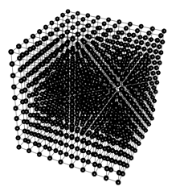
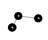
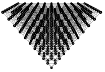

#Building graphs that resemble geometry objects using the lattice function and Gel commands

* **Will be available in version after Mango 1.23**

##The lattice function introduction

The new lattice() function takes a seed graph and tries to replicate the seed graph repetitively to obtain a lattice graph. The lattice graph size is controlled by both the maximum number of nodes that can be added and a maximum bounding box size; both are specified by the users:

```
help lattice;
graph = lattice(graph seed, int max_nodes, float w, float h, float d)
  seed: the seed graph that will be tiled to form the lattice graph;
        _x, _y, _z values in seed graph nodes must be set correctly.
        one node must be named 'anchor' to anchor to tiling nodes.
        one or more nodes must be named with the prefix 'tile...'
        to replicate the seed graph during the tiling process.
  max_nodes: maximum nodes that can be added to the lattice graph.
  w, h, d: width, height & depth of a bounding box that also limit
        the lattice graph; no nodes will be created outside the box.
  If any of the w, h or d values is negative, it defines a circular
        warping around the next axis, e.g, if w is -40, x-axis values
        will fall within a circle around the y-axis with circumference
        40; y-axis warps around z-axis and z-axis warps around x-axis.
```

One of the bounding box size parameter can be negative, which defines a circular warping along that dimension. It’s best to illustrate the warping effect with the following examples, so stay tuned.

The seed graph is the most important parameter to the lattice function. Since nodes in the seed graph will be replicated repetitively according to their relative positions to each other, it is important to set seed graph node positions (i.e., their _x, _y and _z values) correctly before given the seed graph to the lattice function, otherwise the lattice graph constructed by the lattice function may not be what you wanted. In most of the following examples, graph **g** is a seed graph given as argument and graph **r** is the returned lattice graph, so pay attention to how the **g** graph is defined and how the **r** graph is constructed from it; this will help you understand the usage of the lattice function better.

In all the following examples we make use of the same basic node and link type defined as follows:

```
// delcare basic node and link types; nothing fancy
node (string id) nt;
link [] lt;
```

Obviously, additional node and link attributes can be defined for the seed graph, and the resulted lattice graph will carry the same attributes. However, for efficiency, we use minimal attributes on the seed graph. Any additional graph attributes can be easily added to the lattice graph using Gel attribute promotion methods.

##Simple lattice replications

1-, 2- and 3-dimensional seed graphs will produce 1-, 2- and 3-dimensional lattice graphs, respectively:

| g graph | r graph |
| -- | -- |
|||

```
// linear tiling along y-axis
graph(nt, lt) g = { ("anchor", 0, 0)[]("tile1", 0, 1) };
graph(nt, lt) r = lattice(g, 200, 10, 10, 10);
```

-----

| g graph | r graph |
| -- | -- |
|||

```
// 2-D tiling along x-y plane
graph(nt, lt) g = { ("anchor", 0, 0)[]("tile1", 0, 1), "anchor"[]("tile2", 1, 0) };
graph(nt, lt) r = lattice(g, 200, 10, 10, 10);
```

-----

| g graph | r graph |
| -- | -- |
|||

```
// 3-D tiling along all three axes
graph(nt, lt) g = { ("anchor", 0, 0)[]("tile1", 0, 1), "anchor"[]("tile2", 1, 0), "anchor"[]("tile3", 0, 0, 1)};
graph(nt, lt) r = lattice(g, 2000, 9.5, 9.5, 9.5);
```

We can get a box graph out of the cube graph above by using the Gel select command based on node degrees, because interior nodes of the cube will have higher link degrees than outside nodes.

-----

| g graph | r graph |
| -- | -- |
|||

```
// to carve out the interior of the cube do a select based on node degrees
auto s = select node from r where in+out<6;
```

##Dimension warping

As mentioned earlier, one of the bounding box size limit given to the lattice function can be negative. In that case, it specifies a circular warping along that dimension with the circumference of the circle being the absolute value of the negative size. Lattice growth can simultaneously go on the other two non-warping dimensions, creating cylinders or ripples depending on how they were combined with the warping dimension:

| g graph | r graph |
| -- | -- |
|||

```
// linear warping along z-axix (around x-axis)
graph(nt, lt) g = { ("anchor", 0, 0, 0)[]("tile1", 0, 0, 1) };
graph(nt, lt) r = lattice(g, 200, 10, 10, -10);
```

<hr />

| g graph | r graph |
| -- | -- |
|||

```
// 2-D cylinder centered on x-axis (warp on z-axis and tile along x-axis)
graph(nt, lt) g = { ("anchor", 0, 0, 0)[]("tile1", 0, 0, 1), "anchor"[]("tile2", 1, 0, 0) };
graph(nt, lt) r = lattice(g, 200, 10, 10, -10);
```

<hr />

| g graph | r graph |
| -- | -- |
|||

```
// ripples of circles (warp on x-axis while tiling on z-axis)
graph(nt, lt) g = { ("anchor", 0, 0, 0)[]("tile1", 0, 0, 1), "anchor"[]("tile2", 1, 0, 0) };
graph(nt, lt) r = lattice(g, 2000, -20, 10, 20);
```

##Build a pyramid

The pyramid slope degree along each of its four sides is 51.8539761° from the base according to the following website information, thus we first build a seed graph with one anchor node and 4 tile nodes one level down from the anchor at the right angle. After the seed graph is correctly defined, the lattice function easily creates a pyramid:

[http://www.handylore.com/a/math-facts-about-the-great-pyramid](http://www.handylore.com/a/math-facts-about-the-great-pyramid)

| g graph | r graph |
| -- | -- |
|||

```
float offset = cos(3.1415926535897932384626433*2/360*51.8539761);
graph(nt, lt) g = { ("anchor", 0, 10, 0)[]("tile1", offset, 9, -offset), "anchor"[]("tile2", offset, 9, offset), "anchor"[]("tile3", -offset, 9, offset), "anchor"[]("tile4", -offset, 9, -offset), "tile1"[]"tile2"[]"tile3"[]"tile4"[]"tile1" };
graph(nt, lt) r = lattice(g, 1000, 100, 10, 100);
```

Building an inverted pyramid is equally easy, with the seed graph now upside down.

| g graph | r graph |
| -- | -- |
|||

```
float offset = cos(3.1415926535897932384626433*2/360*51.8539761);
graph(nt, lt) g = { ("anchor", 0, -10, 0)[]("tile1", offset, -9, -offset), "anchor"[]("tile2", offset, -9, offset), "anchor"[]("tile3", -offset, -9, offset), "anchor"[]("tile4", -offset, -9, -offset), "tile1"[]"tile2"[]"tile3"[]"tile4"[]"tile1" };
graph(nt, lt) s = lattice(g, 1000, 100, 10, 100);
```

The two pyramids can now be combined to form an octahedron. To do this, note that the lattice function have named each node in each pyramid in the same location with the same name, albeit the nodes are inverted along the y-axis. Realizing that, we can use simple Gel commands to rename nodes to some other names other than those in the base with a y-axis value of zero, so they become distinct. After that, a simple Gel add graph command easily combines the two pyramids to form an octahedron:

```
// to merge the two pyramids to form an octahedron
// first rename all nodes other than the connecting nodes
foreach node in r where _y>0.0 set id="upper".id;
foreach node in s where _y<0.0 set id="lower".id;
// then just add the two parts together
graph(nt, lt) c = r.+s;
```


Finally, we can carve out the interior of the octahedron with a select command based on node degree:

```
// carve out the interior of the octahedron with a select command
graph(nt, lt) b = select node from c where in+out<10;
```


##Build a torus graph

To build a torus graph, we must use some Gel calculations in addition to using the lattice function, as currently the lattice function allows warping only along one dimension while a torus graph needs warping along a primary axis and another warping along a secondary axis. To begin with, let’s build a cylinder with the lattice function:


```
// build a torus graph
graph(nt, lt) g = { ("anchor", 0, 0, 0)[]("tile1", 0, 0, 1), "anchor"[]("tile2", 1, 0, 0), "anchor"[]("tile3", 1, 0, 1), "tile1"[]"tile2" };
// first create a cylinder along the x-axis that will form the torus
graph(nt, lt) r = lattice(g, 2000, 40, 100, -40);
```


Nodes on this cylinder are already wrapping along the z-axis (i.e., around the x-axis). To form a torus, this cylinder must be wrapped along the x-axis (i.e., around the y-axis). First, we need to merge its left-most nodes to its right-most nodes to form a consecutive circular path as required for a torus. This can be accomplished with the map function that renames nodes — If two nodes are renamed to the same name, they will be merged by the map function. Basically, we want the left-most nodes on the cylinder to be renamed to their corresponding right-most node names. A mapping graph d is constructed as follows:

```
// the left- and right-most nodes should be merged by using the map function
graph(nt, lt) a = select node from r where _x==0;  // left-most ring
graph(nt, lt) b = select node from r where _x==40; // right-most ring
graph(nt, lt) c = a*b; // link them, and then keep only horizontal links
graph(nt, lt) d = select link from c where in._y==out._y && in._z==out._z;
// now merge the left- and right-most nodes
graph(nt, lt) e = map(r, d);
```


It’s hard to see the difference between the resulted e graph and the original r graph, but if you care to count the number of rings on the e graph, you can see it has one fewer ring and nodes on its left-most ring now also link to nodes the right-most ring. You can zoom in to see this in Mango.

We can right-click on this e graph in Mango graph canvas to let force-directed layout try to form the torus layout for us, but it will take a very long time. Feel free to try this, but please regenerate the e graph before using the following Gel code to directly map the e graph nodes to a torus.

```
float radius = 15.0;
float two_pi = 3.1415926535897932384626433*2;
float length;
foreach node in e set length=radius+_z, _z=length*sin(_x/40*two_pi), _x=length*cos(_x/40*two_pi);
```


Note that the order of coordinate settings in the foreach command above is important; changing the order will ruin the torus shape.

##Create a ball

The simplest way to create a ball is to carve it out from a cube, but this ball will have rough surface as the cube grid does not provide the best match to a ball shape:

```
graph(nt, lt) g = { ("anchor", 0, 0)[]("tile1", 0, 1), "anchor"[]("tile2", 1, 0), "anchor"[]("tile3", 0, 0, 1), "tile1"[]"tile2"[]"tile3"[]"tile1"};
graph(nt, lt) r = lattice(g, 2000, 9.5, 9.5, 9.5);
center(r);
float radius_s = 25;
graph(nt, lt) b = select node from r where _x*_x+_y*_y+_z*_z<=radius_s;
```


To build a better looking ball, we will start with a hexagonal seed graph, and use it to create a 2-D mesh. From the 2-D mesh, we carve out a mesh circle, which will make half of the ball. We then duplicate the mesh circle, connect the two halves, and finally let Mango’s force-directed layout inflate the ball for us!


```
float angle=3.1415926535897932384626433*2.0*60/360;
graph(nt, lt) g = { ("anchor")[]("tile1", 1, 0), "anchor"[]("tile2", cos(angle), sin(angle)), "anchor"[]("tile3", -cos(angle), sin(angle)), "anchor"[]("tile4", -1, 0), "anchor"[]("tile5", -cos(angle), -sin(angle)), "anchor"[]("tile6", cos(angle), -sin(angle)),"tile1"[]"tile2"[]"tile3"[]"tile4"[]"tile5"[]"tile6"[]"tile1" };
```


----

```
graph(nt, lt) r = lattice(g, 2000, 22, 22, 22);
// cut a circle out
graph(nt, lt) s = select node from r where _x*_x+_y*_y<=101;
```


------

```
// duplicate the circle and rename interior nodes
graph(nt, lt) t = s;
foreach node in t where in+out>=6 set id="n".id, _z=1;
// now add the two halves together
graph(nt, lt) a = s.+t;
// finally, right-clock to let force-directed layout inflate the ball 
// because the seam between the two halves are not quite symmetry, we
// will get a football rather than a basketball.
```


The mesh circle still has rough edges, thus the ball built from it was inflated to a football, not a perfect basketball. One can investigate other seed graph designs to smooth out the mesh circle edge and make a perfect ball. This will be left as an exercise to you.

