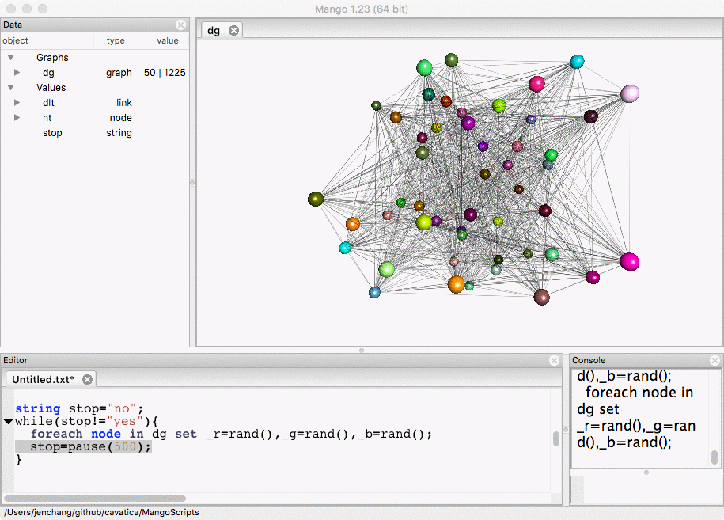
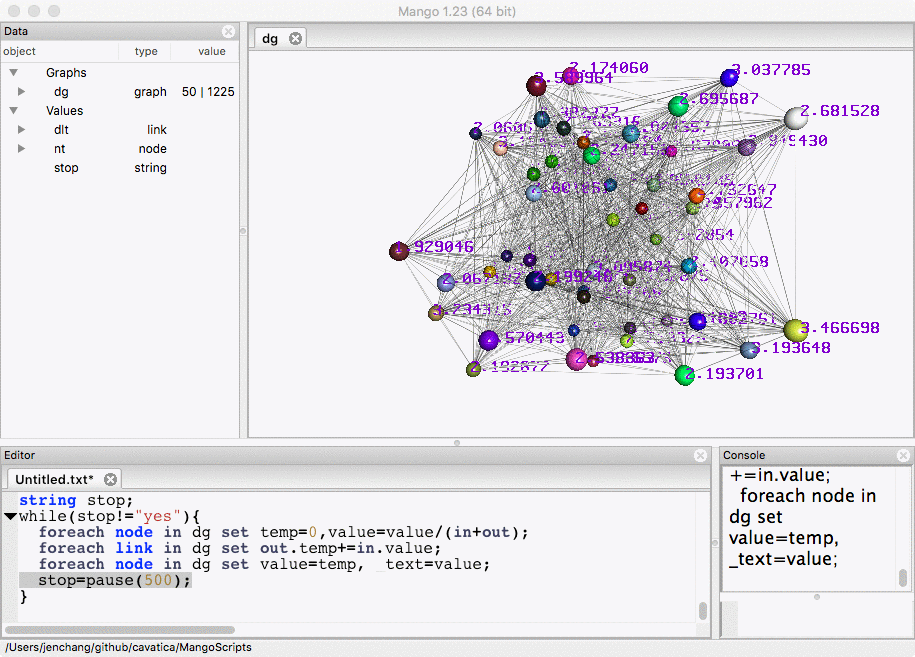
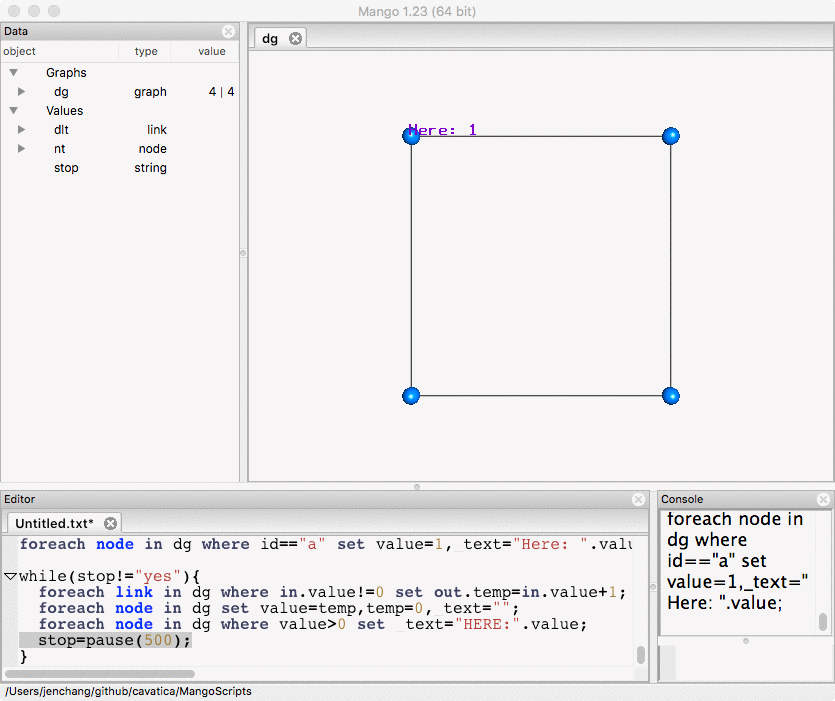

# Looping structures

Gel currently contains while and for loops.

*while loop*
```
int i=0;
while(i<10){
  i++;
}
```

*for loop*
```
int i=0;
int j=0;
for(i=0; i<20; i++){
  j+=i*5;
}
```

## Loops that wait for ESC

The following code iterates a variable *i* until the user presses the **ESC** key. Try it. You should see the i variable update within the data panel. The cursor must be in the Console or Editor. (If the graph canvas has the focus, the ESC key will be ignored). Click on the Console or Editor an then press the **ESC** key to stop. 

```
int i=0;
string stop="no";
while(stop!="yes"){
  i++;
  stop=pause(1);
}
```

# Graph Animation

This allows animation of the graphs. The following code generates a random graph and then randomly assigns colors every 500 milliseconds. Change the number in the **pause** function to change the wait time between loops. Notice you will not be able to run Force-Directed layout while the loop is running.

```
node(string id, float value, float temp) nt;
link<> dlt;
graph(nt,dlt) dg=random(50);

layout(dg,"random");
foreach link in dg set _width=0.5;
/* double click on dg in Data Panel to show in graph canvas */

string stop="no";
while(stop!="yes"){
  foreach node in dg set _r=rand(),_g=rand(),_b=rand();
  stop=pause(500);
}
```



Remember to click on the Editor or Console and press ESC key to stop the animation. 

# Graph Simulation
Then you can do more complicated stuff like propagation of values.

```
node(string id, float value,float temp) nt;
link<> dlt;
graph(nt,dlt) dg=random(50);

/* double click on dg in data panel to show in graph canvas */

layout(dg,"random");
foreach link in dg set _width=0.1;
foreach node in dg set _r=rand(),_g=rand(),_b=rand();

/* assign random values to each node from 0.5 to 10.0*/
foreach node in dg set value=rand(0.5,10.0);
foreach node in dg set _text=value;

string stop;
while(stop!="yes"){
  foreach node in dg set temp=0,value=value/(in+out);
  foreach link in dg set out.temp+=in.value;
  foreach node in dg set value=temp, _text=value;
  stop=pause(500);
}
```



A visualally more simple example of a value propagating around a 4 node directed graph is coded below. The graph is defined in Gel code instead of importing from an external file.

```
node(string id,int value,int temp) nt;
link<> dlt;
graph(nt,dlt) dg={("a")[>("b")[>("c")[>("d")[>"a"};
foreach node in dg where id=="a" || id=="b" set _y=3;
foreach node in dg where id=="c" || id=="d" set _y=-3;
foreach node in dg where id=="a" || id=="d" set _x=-3;
foreach node in dg where id=="b" || id=="c" set _x=3;
foreach node in dg set _b=1,_g=0.5,value=0,temp=0,_text="";
foreach node in dg where id=="a" set value=1,_text="Here: ".value;

while(stop!="yes"){
  foreach link in dg where in.value!=0 set out.temp=in.value+1;
  foreach node in dg set value=temp,temp=0,_text="";
  foreach node in dg where value>0 set _text="HERE:".value;
  stop=pause(500);
}
```

