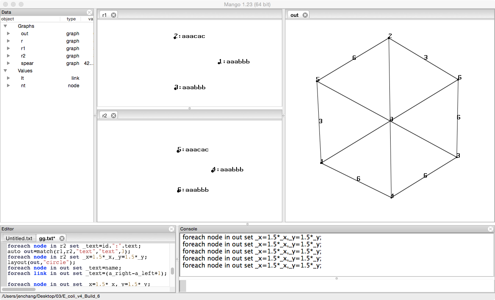

# Commands: match

Description of Match
```
graph = match(graph a, graph b, string a_attr, string b_attr, int min_match, int revcomp, int in_graph)
  a, b: graphs whose nodes are compared; in-graph comparision if a==b
  a_attr: the node attribe name in a that contains sequence data
  b_attr: the node attribe name in b that contains sequence data
  min_match: minimal match length to produce a match link in output
  revcomp: for DNA, 1 finds revese-complement matches; 0 otherwise
  in_graph: 1 or when a==b allows in-graph matches; 0 otherwise
```

Example of use

```
node(string id, string text) nt;
link[] lt;
graph(nt,lt) r1={(1,"aaabbb"),(2,"aaacac"),(3,"aaabbb")};
graph(nt,lt) r2={(4,"aaabbb"),(5,"aaacac"),(6,"aaabbb")};

auto out=match(r1,r2,"text","text",3);

/* visualization*/
layout(out,"circle");
foreach node in out set _text=name;
foreach link in out set _text=(a_right-a_left+1);
```

