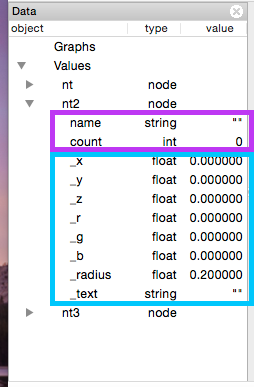

# Graph Data

A graph is defined as a set of nodes and edges. Think of the nodes as the circles in the graph. The edges connect pairs of circles. In a social network, the nodes usually represent individuals. Links represent some type of "relationship" between pairs of individuals, usually friendship. 

Continuing with the social graph example, what type of information might each node contain? Since the node represents an individual, let's call him "Bob", it can contain any information about that individual. Bob might have an age, height, birthdate, favorite color, and home address, just to name a few. 

Defining graphs in GEL requires first defining a **nodetype** and **linktype**. Enter the following GEL commands into the GEL console (bottom right) to define different nodetypes.

```
node(string name) nt;            // most basic nodetype
node(string name, int count) nt2; // also contains node attribute count
node(string id, int count=3) nt3; // contains a default value for count
```

Notice how each one is shown in the Data panel. Expand each one to see the list of attributes.



From the figure, the ones in purple are user defined attributes. The ones in blue, with an underscore prefix, are system defined attributes. 

In the same way, you can define a **linktype** with its associated link attributes.

```
link[] lt;
link<> lt;
link[float weight, string type="undirected"] lt;
link<float weight, string type="directed"> lt;
```

There are some system-defined attributes appended to nodes and links. The **desc** command will display the contents of a node and link type. You can also expand the nt and lt in the **Data** panel

```
desc nt;
desc lt;
```

**Visual attributes** of nodes and links are denoted by an underscore prefix. These represent 3D coordinates (_x,_y,_z), color(_r,_g,_b), text and other visual attributes. The user should not define visual attributes as they are already included in the type definition.

```
node(string name,float _x) nt; //Will throw a syntax error
```

Defining a Graph in GEL with the following commands:

```
node(string name) nt;
link[float weight,int count]lt;
graph(nt,lt)simple={("node1")[0.1,1]("node2")[0.2,2]("node3"),
node1[0.3,3]node3};
desc simple; //show node and link types
dump simple; //show graph contents
```

Importing a Graph from a file with the following commands:

```
node(stringname)in_nt;
link[floatweight]in_lt;
graph(in_nt,in_lt)the40=import("the40.csv");
```

Creating a Random Graph with 64 nodes.

```
graph(nt,lt) ran64=random(64);    //50% connectivity, default
graph(nt,lt) com64=random(64,100); //complete graph
```

Click on the ran64 and the40. You'll notice that both of them seem to only show one node. However, since by default, the position of all nodes are _x=0, _y=0, and _z=0, you will only see one node. Click on simple and type the following:

```
layout("cube");
dump simple;
```

Notice how the xyz coordinates are now different for each node. Try the following commands and watch the effect on the simple visualization:

```
foreach node in simple set_x=rand(-3,3),_y=rand(-3,3),_z=rand(-3,3);
foreach node in simple set_r=rand(),_g=rand(),_b=rand();
foreach node in simple set_r=rand(),_g=rand(),_b=rand();
foreach link in simple set_r=rand(),_g=rand(),_b=rand();
```

Export graphs
```
export("simplenew.tsv","tsv",simple); //saves simple as a tab delimited file
save "state.txt"; //saves all graphs as GEL commands
```

Reload graphs

```
clear;           //clears all graph data
run "state.txt"; //reload saved graph data
```

You can access specific attributes in a graph using the following:
```
node(string name) nt;
link[float weight] lt;
graph(nt,lt) g = {("node1")[1.0]("node2")};

g.node."node1"._x=10;
g.link."node1":"node2".weight=10;
```

Node Type
---
Gel is different from many other graph analysis scripts in that it takes into account node and link attributes. However this means you have to define a node type or a link type. Since nodes are identified by unique strings, the basic node type is defined with one string attribute. Node is defined with the keyword **node**, list of attributes in parenthesis, and node type name. The list of attributes are a list of any of the primitive 4 data types (string, int, float, double). 

```
node(string name) nt; /* most basic node type */
node(string id) nt;   /* can be named anything */
```

Nodes can have multiple attributes.

```
node(string name, int age, float weight, string birthdate) person;
```

Nodes can have default values

```
node(string name, int age=20, float weight=120, string birthdate="January 1, 1990") person;
```

You can combine node types:

```
node(string name, string color) nt;
node(string name, int age) nt2;
node(nt, nt2) nt3;

desc nt3; /* string name, string color, int age */
```

Link Type
---

##Importing a graph from a file


