## Quick Start Demo

This section demonstrates loading 4 networks, merging those networks via graph mathematics, and exporting the new graphs. The purpose of this section is to give a quick example. For a more complete walk-through with explanations see Regular Start. 

**Things you will need:**

* [Mango Graph Studio](https://www.complexcomputation.com/en/download-mango/)
* [DemoFiles folder](files/DemoFiles.zip)--should come with the Mango installation

**Outline** 

* Load 4 graphs
* 3D interactive visualization
* Merge graphs
* Export/Save resulting merged graphs

### Load 4 graphs

Open **Mango** and you should be presented with the following screen. The window is divided into four sections. 

* **Data**: displays a list of all data objects in Mango 
* **Canvas**: displays the graph visualizations
* **Editor**: area to edit Gel (Graph Exploration Language) scripts and run them line by line. 
* **Console**: accepts Gel commands and runs them in real time

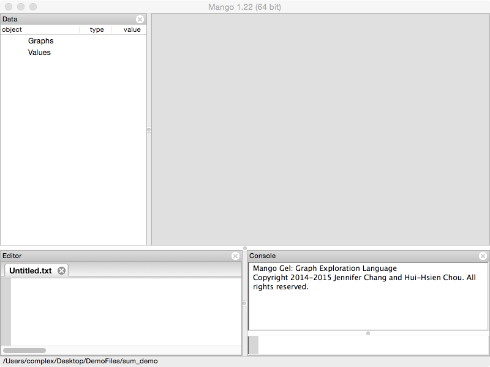

Go to **File/Open** and open the "gel\_sum.txt" file inside of the **DemoFiles/sum\_demo** folder that came with Mango installation.

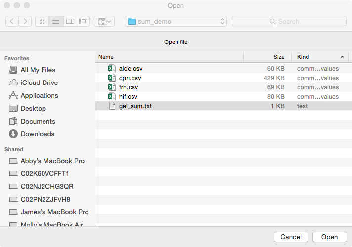

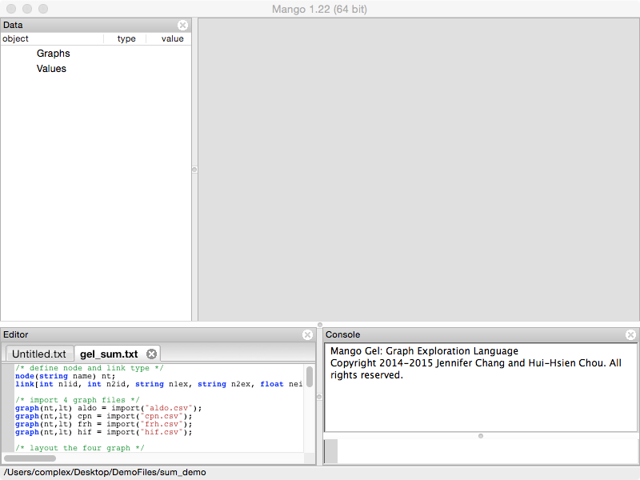

"gel\_sum.txt" contains Gel commands. **Gel** stands for the **Graph Exploration Language**. Gel allows reproducible multi-graph analysis. It's a flexible powerful language that will continue to be developed. Functions are designed for multi-graph analysis.

The script should be loaded into the **Editor** panel. Since this is a quick start, we are going to avoid explaining the meaning of each line. Instead we will show you how to run commands line by line.

Click on the first line in "gel\_sum.txt" to place the cursor. If you are on Windows or Linux, press `Ctrl`+`Enter`. If you are on Mac, press `Cmd`+`Return`. Press this key combination multiple times. Each time, Mango will execute the line. 

Repeat this until all four graphs have been loaded into Mango or when you see a comment that says "PAUSE HERE FOR QUICK START TUTORIAL". Loaded graphs will be listed in the **Data** panel. 

```
/* define node and link type */
node(string name) nt;
link[int n1id, int n2id, string n1ex, string n2ex, float neighborhood, float fusion, float cooccurence, float homology, float coexpression, float experimental, float knowledge, float textmining, float combined_score] lt;

/* import 4 graph files */
graph(nt,lt) aldo = import("aldo.csv");
graph(nt,lt) cpn = import("cpn.csv");
graph(nt,lt) frh = import("frh.csv");
graph(nt,lt) hif = import("hif.csv");

/* PAUSE HERE FOR QUICK START TUTORIAL */
```

In the **Data** panel (left), four graph objects are listed inside **Graph**. 

Double click on their names and visualizations of the selected graphs will appear in the Graph Canvas (right center) on separate tabs. Tabs are labeled with the graph names, you can drag and rearrange the tabs or show multiple graphs at once.

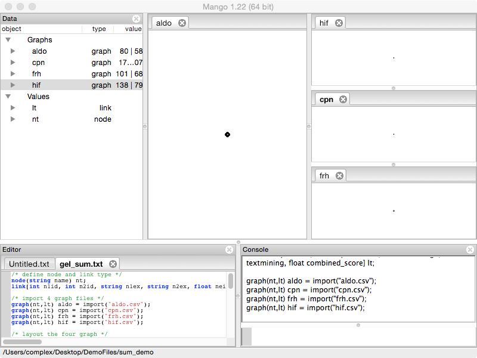

### 3D interactive visualization

Execute the following layout commands using ```control```-```enter``` (Windows/Linux)or ```command```-```return``` (Mac). 

```
/* layout the four graph */
foreach node in aldo set _x=0,_y=rand(-5,5),_z=rand(-5,5);
foreach node in frh set _x=2,_y=rand(-5,5),_z=rand(-5,5);
foreach node in hif set _x=-2,_y=rand(-5,5),_z=rand(-5,5);
foreach node in cpn set _x=-4,_y=rand(-5,5),_z=rand(-5,5);

/* color nodes and links in each graph */
foreach node in aldo set _r=rand(0.5,1),_g=0,_b=0;
foreach link in aldo set _r=rand(0.5,1),_g=0,_b=0;
foreach node in cpn set _r=rand(0.5,1),_g=rand(0.5,1),_b=rand(0.5,1);
foreach link in cpn set _r=rand(0.5,1),_g=rand(0.5,1),_b=rand(0.5,1);
foreach node in frh set _r=0,_g=rand(0.5,1),_b=0;
foreach link in frh set _r=0,_g=rand(0.5,1),_b=0;
foreach node in hif set _r=0,_g=0,_b=rand(0.5,1);
foreach link in hif set _r=0,_g=0,_b=rand(0.5,1);
```

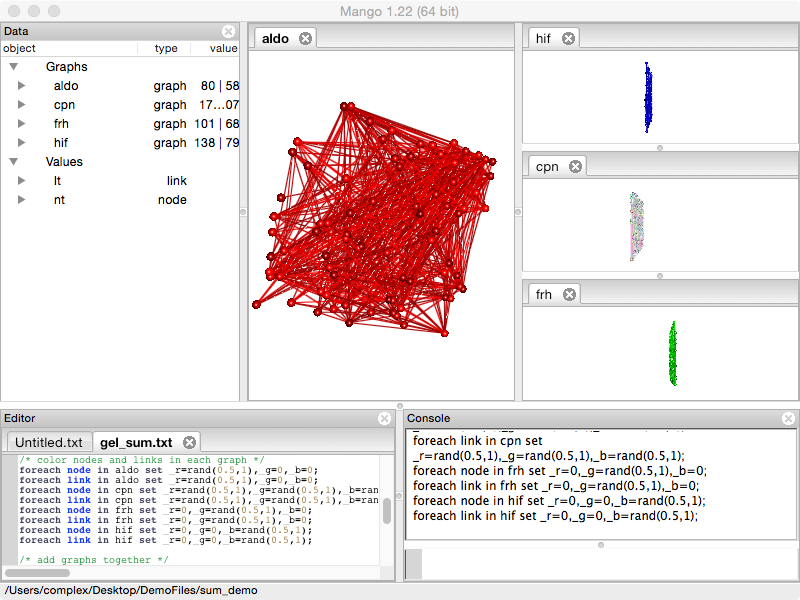

The **Graph Canvas** (right center) area responds to mouse and keyboard events. **Left click and drag** across the graph. This will rotate the graph visualization. 

Use the **Roller Ball** on your mouse (or two finger swipe up or down on a trackpad or touch screen) to zoom in and out of the graph. 

Making sure one of the graphs is selected (the tab label will be bolded) use the **arrow keys** on your keyboard to move the graph left, right, up and down. 

Next, **Right click** on one of the displayed graphs. The graph should start to move where connected nodes moving closer together and disconnected nodes moving farther apart. This is the **force-directed layout** algorithm proposed by Eades. Right click again to stop the animating layout.

To explore some other graph layouts, close all tabs except graph **cpn** and type the following Gel commands (capitalization matters) into the **Console** (bottom right). Try rotating, zooming, and running the force-directed layout after each command.

```
layout(cpn, "circle");
layout(cpn, "cube");
layout(cpn, "random");
```

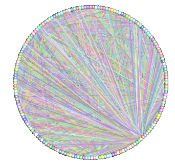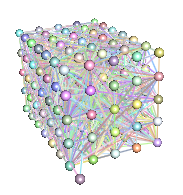

Run the following command:

```
layout(cpn, "cube");
```
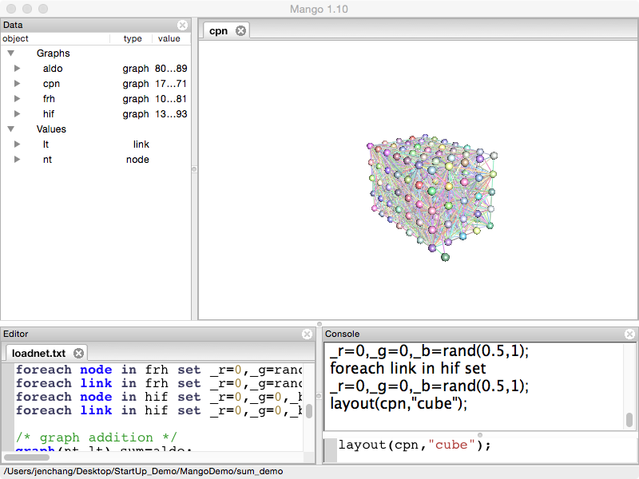

Right click to start the force-directed layout. Notice that the background will dim. Right click again to stop the force-directed layout and the background will revert to normal.

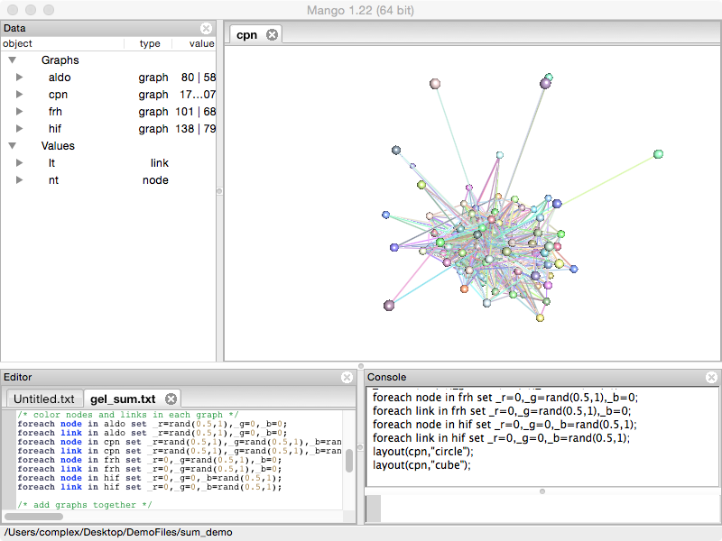

Turn on node labels by typing the following:

```
foreach node in cpn set _text=name; /* turns on labels */
foreach node in cpn set _text="";   /* turns off labels */
```

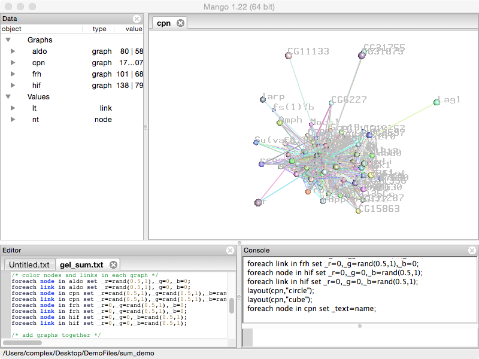

### Merge graphs

Rerun the layout section in "gel_sum.txt".

```
/* layout the four graph */
foreach node in aldo set _x=0,_y=rand(-5,5),_z=rand(-5,5);
foreach node in frh set _x=2,_y=rand(-5,5),_z=rand(-5,5);
foreach node in hif set _x=-2,_y=rand(-5,5),_z=rand(-5,5);
foreach node in cpn set _x=-4,_y=rand(-5,5),_z=rand(-5,5);
```

Execute the following commands in the "gel_sum.txt" script. Double click on the **sum** network. 
```
graph(nt,lt) sum = aldo;
sum .+=cpn;
sum .+=frh;
sum .+=hif;
```

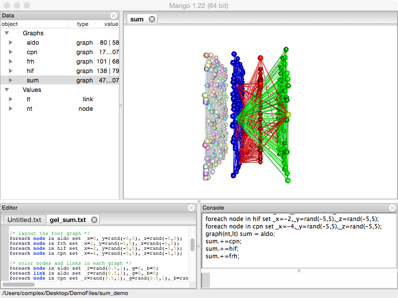

Notice how graphs are added together. When you rotate the graph, you should notice that **cpn** is not connected to the other networks. Therefore we're going to remove **cpn** using the following command.

```
sum.-=cpn;
```

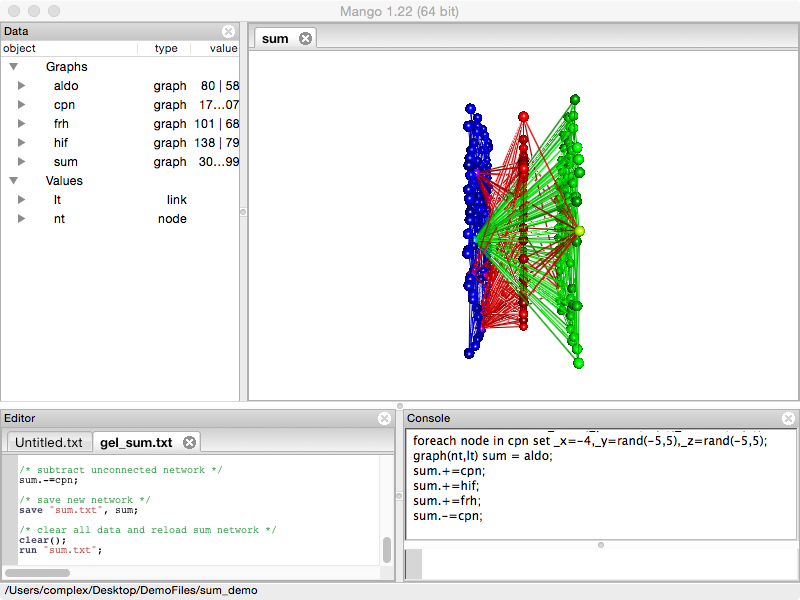

Right click and run the force-directed layout to spread out the graph.

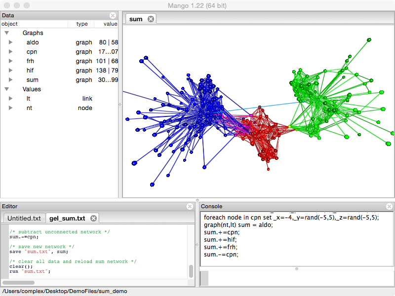

## Export/Save resulting merged graph

There are multiple ways to store the new graph. The new graph file is saved to the current directory, shown on the bottom of the window.

If you want to reload the 3D visualization into Mango, use **save**. Since the graph is saved as a Gel script, run the script to reload the graph. 

```
save "sum.txt", sum; /* save the sum graph */
clear();             /* clears all data objects from Mango */
run "sum.txt";       /* reload the sum graph */
```

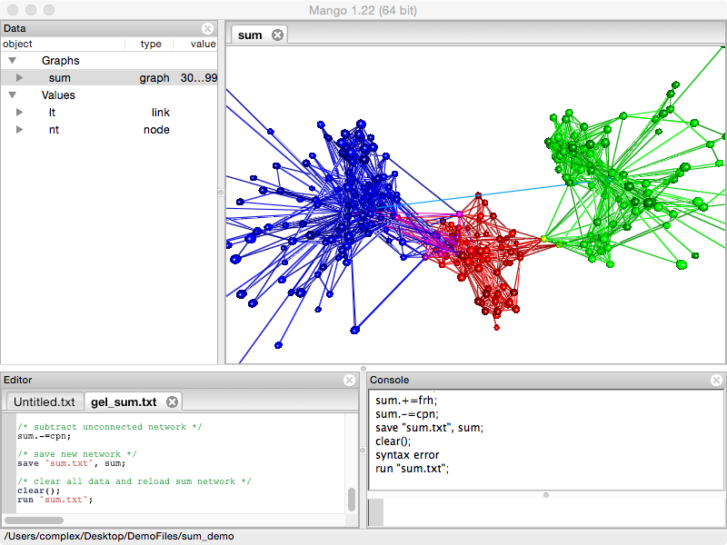

If you want to save the network as a tab or csv file, use **export**. This file can be opened in Excell, or sent to R and Matlab.

```
export("sum.tsv","tsv",sum);
```

For those who prefer GraphViz, graphs can be exported in the dot language.

```
export("sum.dot","dot",sum);
```

