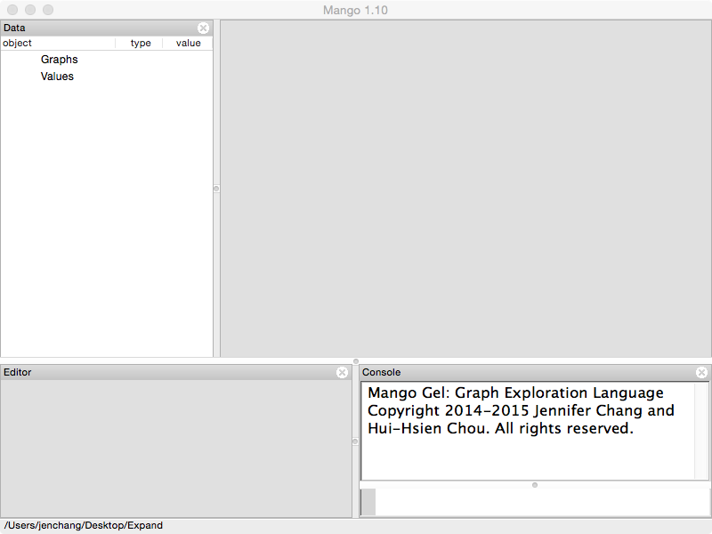
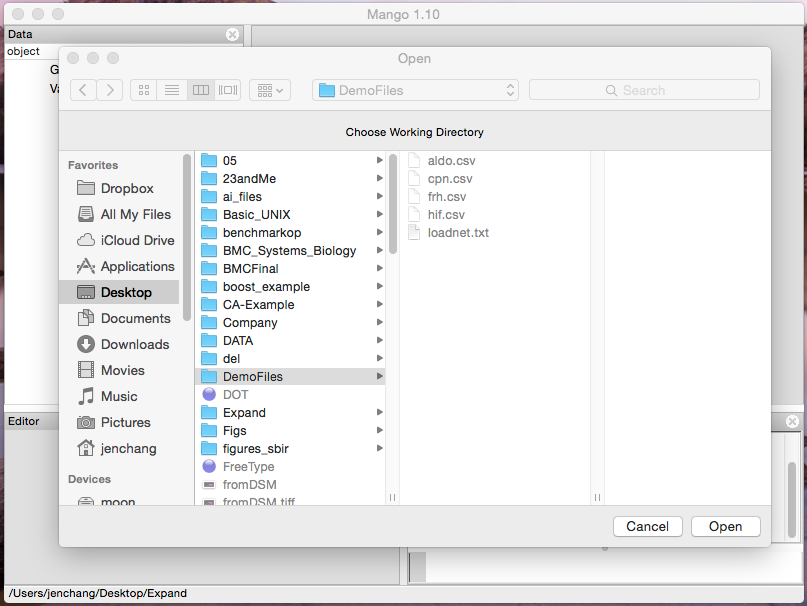
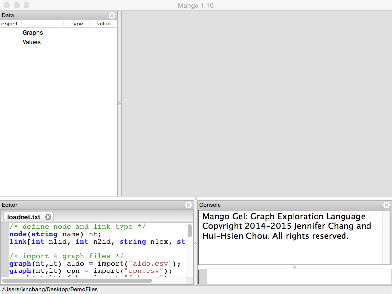
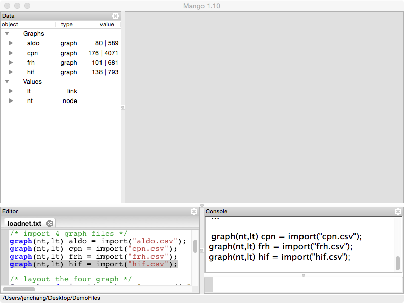

## Install Mango

Install **Mango** by going to http://www.complex.iastate.edu/download/Mango and registering a free account. You will receive an email shortly with your new password. Use your email and new password to log into the download area and select the installation file for your operating system. 

## Quick Start Demo

Open **Mango** and you should be presented with the following screen. The window is divided into four sections. 

* **Data**: displays a list of all data objects in Mango 
* **Canvas**: displays the graph visualizations
* **Console**: accepts gel commands and runs them in real time
* **Editor**: area to edit gel scripts and run them line by line



The **Console** (bottom right) is where you can type and execute GEL commands. All GEL commands end with a semi-colon symbol. Type the following into the **Console** and press **Enter/Return**:

```
setwd();
```

**setwd** pops a window to allow you to select the current working directory. This directory may contain your graph or GEL script files. Navigate and select the **DemoFiles** folder that came with Mango installation.



Now we're going to load 4 graph files. Go to **File/Open** and select "loadnet.txt". The file should be loaded into the **Editor** panel.



Click within the loadnet.txt, and place the cursor at the first line. Then press **Alt-Enter** if you're on Mac or **Ctrl-Enter** if you're on Windows or Linux to execute one line. Repeat this until all four graphs have been loaded into Mango. They will be listed in the **Data** panel. 



In the **Data** panel (left), four graph objects are listed inside **Graph**. Double click on their names and visualizations of the selected graphs will appear in the Graph Canvas (right center) on separate tabs. Tabs are labeled with the graph names, you can drag and rearrange the tabs or show multiple graphs at once.

The **Graph Canvas** (right center) area responds to mouse and keyboard events. **Left click and drag** across the graph. This will rotate the graph visualization. 

Use the **Roller Ball** on your mouse (or two finger swipe on a trackpad) to zoom in and out of the graph. 

Making sure one of the graphs is selected (the tab label will be bolded) use the **arrow keys** on your keyboard to move the graph left, right, up and down. 

Next, **Right click** on one of the displayed graphs. The graph should start to move where connected nodes moving closer together and disconnected nodes moving farther apart. This is the **force-directed layout** algorithm. 

